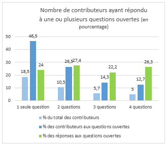
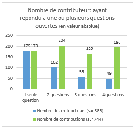
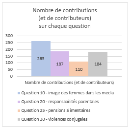

% **Analyse et évaluation du processus de consultation Égalité Femmes / Hommes**
% Novembre 2016
%

\newpage

# Introduction

## Contexte

Le Comité d’Évaluation et de Contrôle (CEC) de l’Assemblée nationale a décidé de lancer une consultation citoyenne afin d’évaluer l'impact de la [loi sur l’Egalité Femmes / Hommes du 4 août 2014](http://www.assemblee-nationale.fr/14/dossiers/egalite_femmes_hommes.asp).

L'association Regards Citoyens a été sollicitée pour faire partie du comité de suivi de cette consultation citoyenne, en tant que représentant de la société civile. L'association possède en effet une solide expertise dans l’analyse et le traitement des données liées à l’élaboration des lois ainsi que dans la confection d'outils numériques permettant de comprendre les institutions démocratiques, tels que peuvent l'illustrer ses projets emblématiques [NosDéputés.fr](http://NosDeputes.fr), [NosSénateurs.fr](http://NosSenateurs.fr) ou [La Fabrique de la Loi](http://www.lafabriquedelaloi.fr).

Afin de compléter son expertise, peu développée dans le domaine des consultations citoyennes à proprement parler, Regards Citoyens s'est associée avec [FaisTaLoi.org](http://FaisTaLoi.org) et [DemocracyOS France](http://democracyos.eu/), deux organisations expertes dans les méthodes et dispositifs de démocratie délibérative et participative.

## Position générale à l’égard des consultations citoyennes menées dans un cadre législatif

Les consultations citoyennes peuvent améliorer grandement la qualité et la légitimité de la loi en favorisant :

 - Une expertise parlementaire plus objective et plus fine des problèmes publics en permettant la mise en place d’enquêtes qualitatives auprès des personnes directement concernées ou impactées par la loi, dans une logique d'intelligence collective partagée. Les députés, souvent experts de leur domaine, peuvent avoir l'impression de connnaître déjà très bien leur sujet et de ne pas avoir besoin des citoyens pour cela ; pourtant, cette expertise est aussi précisément ce qui peut les empêcher de comprendre réellement les problèmes publics : « Ce qui est bien connu, c’est ce qu’il y a de plus habituel, et l’habituel est ce qu’il y a de plus difficile à « connaître », c’est-à-dire le plus difficile à considérer comme problème, à voir par son côté étrange, lointain, "extérieur à nous-mêmes"…» (Nietzsche, Le Gai savoir, §355) ;
 - Une expression plus juste de la volonté générale en incluant dans l’élaboration de la loi les points de vue, expériences et analyses de publics minoritaires ou disposant de peu de relais au Parlement, dans l’opinion, les media ou les sphères d’influence.

Les initiatives récentes de l'Assemblée nationale en matière de consultation sont donc à saluer.

Les consultations citoyennes prennent sens dans le cadre d’une théorie de la démocratie renouvelée fondée sur l’enquête, l'intelligence et la délibération collectives sur les problèmes publics, tels que des philosophes pragmatistes comme J. Dewey ont pu la défendre, et non sur une démocratie d’opinion dans laquelle on se satisfait que la volonté générale soit réduite à la volonté partisane d’un groupe majoritaire.

Sans douter de l'engagement sincère d'un certain nombre de parlementaires soucieux d'ouvrir le travail législatif aux citoyens, aujourd’hui la majeure partie des consultations citoyennes portées par des acteurs publics ou privés ne sont pas conçues comme des outils d’enquête, d'intelligence et de délibération collectives mais instrumentalisées, dans une logique de démocratie d’opinion, soit comme outils de communication visant à légitimer « par la base » des décisions publiques déjà actées, soit comme outils d’influence et de lobbying visant à faire passer la volonté particulière de certains acteurs pour la « volonté générale » des citoyens.

Les consultations citoyennes sont en effet des dispositifs facilement manipulables, encore plus que les sondages. Que ce soit dans la manière de poser les questions, d'exposer les faits ou de présenter des informations aux contributeurs, la manière de sélectionner les participants invités à contribuer ou la manière de synthétiser et sélectionner les contributions, il est possible de leur faire dire ce que l'on veut.

C'est pourquoi il est nécessaire, pour toute consultation citoyenne, de prévoir des garde-fous démocratiques afin d'éviter au maximum les risques de manipulation du processus de consultation.

Ces garde-fous passent pas deux prérequis importants :

 - la transparence des plateformes numériques de gestion de consultation ainsi que de l'information qu'elles produisent ;
 - la mise en place systématique de comités de suivi et de contrôle incluant des membres de la société civile.

Les initatives prises par le CEC de rendre accessibles quotidiennement en Open Data les réponses de la consultation et la mise en place d'un comité de suivi (quoique peu expert en matière de consultation) va donc dans le bon sens.

S'étant efforcé, à travers le présent rapport, d'exercer un rôle de tiers garant, désintéressé, critique, vigilant mais toujours constructif, Regards Citoyens espère inciter les parlementaires désireux d'améliorer la qualité et la légitimité de la loi à effectuer un changement fécond de paradigme dans leur conception et usage des consultations citoyennes.

## Contributions de Regards Citoyens

Regards Citoyens et ses partenaires ont apporté leur expertise au comité de suivi de la consultation en contribuant à trois étapes clefs du processus :

 - en amont de la consultation, en donnant leur avis sur le projet de questionnaire de consultation conçu par le CEC ;
 - pendant la consultation elle-même, en mettant en place une [plateforme dite "Rapporteurs Citoyens"](http://www.regardscitoyens.org/rapporteurs-citoyens/) de lecture et d'analyse collective des réponses au questionnaire par des volontaires (initiative appelée "crowdsourcing") ;
 - en aval de la consultation, en produisant des analyses quantitatives et sémantiques des réponses au questionnaire et un bilan de l'opération de crowdsourcing.

### Contributions en amont de la consultation

Le CEC a soumis aux membres du comité de suivi son projet de questionnaire. Il s’agissait alors d’un projet de questionnaire à choix multiples, sans aucune question ouverte. Ce questionnaire est apparu à Regards Citoyens comme à la fois très long, peu susceptible de permettre une évaluation rigoureuse de l'impact de la loi, et peu susceptible de faire surgir des éléments de compréhension utiles aux députés.

Le CEC n'envisageant pas de revoir totalement la conception du formulaire et afin d’être constructif, Regards Citoyens a proposé d’ajouter des questions ouvertes à chacun des 4 grands thèmes de la consultation (images des femmes dans les media, partage des responsabilités parentales, pensions alimentaires impayées, violences conjugales). Si Regards Citoyens a insisté pour que des questions ouvertes soient ajoutées, c'est parce qu'elles permettent d'obtenir, dans le cadre d'une démocratie d'enquête, des réponses plus diverses, originales et qualifiées que des questions à choix multiples dans lesquelles le nombre et la nature des réponses sont prédéfinis par celui qui pose les questions et ne peuvent donc apporter aucune information qualitative nouvelle aux députés.

Les questions suggérées par Regards Citoyens pour chacun des thèmes de la consultation n'ont pas été retenues par le CEC. Ce dernier a néanmoins décidé d’ajouter une question ouverte très générale à la fin de chacun des 4 thèmes de la consultation, formulée à l'aide de la même consigne type : "Si vous avez d’autres informations ou expériences qui vous semblent intéressantes pour ...., vous pouvez les exprimer ici : ".

Regards Citoyens avait aussi proposé d'ajouter une question fermée permettant de mieux qualifier l'apport des contributeurs au travail législatif en demandant à chaque contributeur, au tout début du questionnaire, en quoi il pensait pouvoir aider les députés sur les problèmes liés à l'égalité Femmes / Hommes. La formulation proposée était, pour chaque thème :

Je peux aider les députés car :

 - je subis (ou ai subi) personnellement ce problème
 - je suis en contact avec des personnes qui subissent ce problème
 - je peux, par mon action, améliorer ou aggraver en partie ce problème
 - j’ai fait des recherches approfondies sur ce problème
 - je pense avoir une opinion intéressante sur ce problème

Cette question avait pour objectif :

 - d'inciter les contributeurs à prendre conscience de la nature de la plus-value de leurs contributions à la consultation avant qu'ils ne contribuent, les incitant ainsi à contribuer de manière plus pertinente et qualifiée, non pas simplement en énonçant leur opinion générale sur telle ou telle question, mais en mobilisant leurs savoirs ou expériences spécifiques dans leurs réponses ;
 - de pouvoir comparer, grâce au crowdsourcing, le contenu effectif des réponses aux questions ouvertes avec les déclarations des contributeurs à cette question afin de mesurer le degré de qualification des réponses (ex : un contributeur qui a déclaré subir personnellement le problème du partage des responsabilités parentales a-t-il produit une contribution faisant explicitement appel à son expérience personnelle ?).

Le CEC a retenu cette question mais en la plaçant en toute fin de questionnaire et en la scindant en deux, ce qui lui a fait perdre un peu de sa pertinence et de sa précision en ne permettant plus aux contributeurs de préciser le thème sur lequel ils pouvaient apporter chaque type d'aide.

Enfin, l'association a proposé d'ajouter une question ouverte permettant aux personnes répondant à la consultation de suggérer des améliorations sur la consultation elle-même afin de permettre à l'Assemblée d'améliorer les prochains processus consultatifs. Cette question a été intégrée dans la partie finale du questionnaire.

### Contributions au cours de la consultation

Afin de s'assurer que chaque réponse apportée à une question ouverte soit lue, une analyse humaine des contributions a été mise en place. 744 contributions substantielles ont ainsi été analysées.

Pour ce faire une [plateforme d'analyse collaborative dite "crowdsourcing"](http://regardscitoyens.org/rapporteurs-citoyens/) a été développée et mise en place par Regards Citoyens. Cette plateforme présentait aux visiteurs, appelés "rapporteurs citoyens", une contribution sélectionnée de manière aléatoire dans la base des contributions collectées sur le site de la consultation. Cette base était mise à la disposition de tous en Open Data et actualisée chaque jour par l'Assemblée nationale. Chaque rapporteur citoyen était alors invité à décrire via une grille d'analyse de trois questions fermées la contribution qui lui était présentée. De manière aléatoire, il pouvait aussi lui être demandé de synthétiser un élément de la contribution.

Durant les deux semaines qu'à duré cette opération d'analyse, 434 internautes ont participé à l'opération en analysant au moins une contribution.

En plus de cette mobilisation en ligne, une soirée "crowdsourcing party" a été organisée où une vingtaine de personnes se sont retrouvées à Paris pour particier à l'opération de crowdsourcing.

Chaque réponse a été analysée par au moins 3 personnes différentes (jusqu'à 11 par contribution) pour un total de 3751 analyses produites.

### Contributions en aval de la consultation

Regards citoyens a produit quatre analyses dont les résultats sont exposés dans le présent rapport. Ces analyses ont été produites bénévolement et collectivement par les membres de Regards Citoyens en partenariat avec les membres de FaisTaloi et de DemocracyOS.

 - Une analyse statistique des réponses aux questions fermées du questionnaire de l’AN
 - Une analyse quantitative des réponses aux questions ouvertes du questionnaire de l'AN
 - Une analyse sémantique des réponses aux questions ouvertes
 - Une analyse des résultats de l'initiative de crowdsourcing

La première analyse vise principalement à déterminer le degré de diversité des profils de réponse des contributeurs et à détecter d'éventuels biais d'uniformité dans les publics invités à contribuer. 

La deuxième analyse vise à mesurer le degré de qualification et d'engagement des contributeurs.

La troisième analyse vise à s'assurer qu'aucun thème abordé lors de l'analyse des questions ouvertes par le crowdsourcing n'a été oublié.

La quatrième analyse vise à compléter l'analyse de la qualification des contributeurs et à déterminer dans quelle mesure des citoyens peuvent être sollicités pour accompagner les services de l'Assemblée dans leur travail de lecture et d'analyse des contributions au questionnaire.

\newpage

#Analyse statistique des réponses aux questions fermées

##Objet et intérêt de l’analyse

Regards Citoyens a souhaité effectuer une analyse statistique des réponses aux questions fermées du questionnaire de l'AN.

Cette analyse n'avait évidemment pas pour objectif d'agréger les réponses pour déterminer ce que les citoyens français pensent sur les différents thèmes de la consultation proposée par l'AN. Une consultation citoyenne ouverte à tous en ligne ne peut en effet être exploitée comme un sondage, dans la mesure où il n'y a aucune maîtrise statistique de l'échantillon interrogé.

L'analyse statistique des réponses aux questions fermées d'une consultation ne peut avoir pour objectif que de mesurer la diversité des profils de réponses apportées par les contributeurs.

Dans une logique de démocratie d'enquête, une consultation citoyenne ouverte est considérée en effet comme d'autant plus riche et féconde que chaque contributeur a des réponses originales et peu stéréotypées par rapport à celles de son voisin.

Dans une logique de démocratie d'opinion, au contraire, on sera tenté de chercher, à travers une consultation citoyenne ouverte, la plus grande uniformité et prévisibilité possible des réponses, en orientant les questions posées de manière à limiter la diversité des réponses possibles, ou en essayant de contrôler le profil des publics invités à participer, en particulier en faisant appel à des publics militants dont les réponses et analyses sont déjà bien identifiées. Il suffit en effet de communiquer davantage auprès de tel ou tel public pour s'assurer que les positions qu'on souhaite voir émerger soient les mieux représentées au sein de la consultation.

L'analyse de la diversité des profils de réponse permet donc de détecter l'existence d'un biais d'uniformité dans la manière de poser les questions ou la manière de solliciter le public pour répondre au questionnaire. Elle permet aussi de détecter d'éventuelles contributions de masse à la consultation opérées par des groupes d'influence décidés à utiliser la consultation citoyenne comme outil de lobbying.

Dans le rapport de synthèse de la consultation de l'Assemblée sur la fin de vie, les auteurs dressent ainsi un bref tableau binaire des contributions générales proposées par les internautes sur le texte, en distinguant d’un côté les partisans de l’euthanasie qui regrettent que le texte n’aille pas assez loin et qui sont, selon les auteurs de la synthèse, constitués pour moitié de commentateurs qui s’identifient explicitement comme membre de l’Association pour le droit de mourir dans la dignité (ADMD), de l’autre les opposants à l’euthanasie qui regrettent que le texte aille trop loin et dont, selon les auteurs, « certains […] se revendiquaient de la Fondation Lejeune ou des Associations familiales catholiques.  ». Et les auteurs d’ajouter : « Il faut noter que dans les derniers jours d’ouverture de la consultation, la majorité des contributions étaient des copiés-collés de textes envoyés par diverses associations à leurs membres ». La présence de questions fermées et la réalisation d'une analyse des populations aurait peut être permis de mesurer ce ressenti de manière plus objective, de mesurer les différents courants de pensée qui co-existent au sein de ces associations, mais également d'identifier d'autres communautés que celles qui ont recours à des réponses massives à cette consultation.

Une grande diversité des profils de réponse se traduit, au cours de l'analyse statistique, par une distribution forte et relativement égale des options de réponses à chaque question et par la difficulté à faire émerger des corrélations entre la manière dont un contributeur répond à une question et la manière dont il répond à une autre.

Dans le cas de la présente consultation, le CEC a affirmé avoir communiqué auprès d'une base de 500 associations concernées par les problématiques de l'égalité Femmes / Hommes. Cette base contenait-elle des acteurs aux profils de réponse suffisamment différenciés ? Des groupes d'influence constitués bien identifiés ont-ils contribué à cette consultation ?

Pour le savoir, l'analyse statistitique s'est efforcée de répondre aux deux questions suivantes :

- Les réponses à chaque question sont-elles assez bien réparties entre l'ensemble des options proposées par le questionnaire ? 
- Est-il possible de dégager des "populations" spécifiques, aux profils de réponse homogènes et bien distincts ? 

## Méthodologie suivie

La méthode statistique utilisée pour l'analyse des "populations" est la ["clusterisation k-moyenne" ou k-mean](https://fr.wikipedia.org/wiki/K-moyennes).

Toutes les contributions ont été représentées sous la forme d'une matrice où chaque ligne correspondait à un utilisateur de la consultation et chaque colonne une réponse possible (codée en 0 pour la non sélection de cette réponse par l'utilisateur ou 1 pour réponse sélectionnée). Une colonne par question a été ajoutée indiquant par 1 si l'utilisateur y a répondu ou 0 si non. Cette matrice a permis de faire émerger des similarités de comportement entre contributeurs de la consultation. La clusterisation permet de faire émerger des groupes de personnes ayant un comportement similaire dans leurs manière de répondre aux questions. Nous appelons ces groupes "population".

Une recherche de population/profil k-mean a été réalisé pour chaque thème.

## Principaux résultats de l'analyse

L'analyse statistique montre de manière assez susprenante que le sexe déclaré des répondants n'est pas un critère réellement impactant sur la manière dont les gens ont répondu à la consultation. Le sexe n'est pour aucun thème un élément constitutif d'une population trouvée, c'est à dire qu'il n'a pas été possible de retrouver une population très majoritairement constituée de femmes dont les réponses s'opposaient à une population très majoritairement constituée d'hommes. Seuls pour deux questions liées aux améliorations possibles des impayés de pensions et au niveau d'informations donné aux femmes victimes de violence à propos des dispositions sur les ordonnances, il a été possible de noter une plus grande présence de répondant masculins (10 à 20% de femmes en moins par rapport aux autres populations).

Le préjugé que cette consultation aurait été instrumentalisée par des "lobbies masculinistes" semble donc totalement infondé.

Les questions liées à la connaissance des dispositifs présentés sont à première vue (sauf pour le thème n° 4 sur les pensions alimentaires) les questions qui impactent le plus la manière dont les gens répondent à la consultation, et notamment car il y a une forte corrélation entre le fait de connaître deux dispositions d'un même thème (lorsqu'on connaît les dispositions de signalement Internet, on a plus de chance de connaitre les dispositions liées aux médias). En revanche, étonnemment, les réponses liées aux connaissances n'ont que très peu d'impact sur les réponses liées aux opinions des répondants sur ces dispositifs. Lorsqu'il y a une variation notable, le groupes des personnes connaissant les dispositifs ne sont constitués que très légèrement de plus d'individus favorables aux dispositions (variation d'environ 10% par rapport à l'autre groupe), l'opinion majoritaire du groupe restant proche de celle des personnes annoncant ne pas connaître les dispositions.

Par leurs liens entre elles, les questions relatives à la connaissance des dispositifs n'apportent donc peu de connaissance sur les communautés interrogées.

## Analyse statistique de la répartition des réponses à chaque question

### Thématique 2 : image des femmes, médias audiovisuels et internet

La connaissance des dispositions liées au signalement internet crée deux populations : les personnes qui connaissent le dispositif et celles qui ne le connaissent pas. Élément surprenant de cette dichotomie est que la connaissance ou non des dispositions n'a que peu d'impact sur les autres réponses : les personnes qui connaissent les dispositions de signalement internet sont plus nombreuses à connaitre les dispositions liées à la télévision (45% au lieu de 20%) et elles sont légèrement plus nombreuses à avoir le sentiment que les dispositions de signalement internet sont mieux respectées (à la question n° 7, elles ont répondu "Assez bien respectée" à 20% contre 6% pour les personnes ne connaissant pas le dispositif et "Pas du tout respectée" à 23% contre 40%) et sont légèrement plus indulgentes sur son efficacité pour lutter contre des contenus sexistes sur Internet (17% ont répondu qu'il n'était "pas du tout adapté" contre 27%). Pour les autres questions, il n'y a pas de différences statistiques notables.

En ignorant les questions liées à la connaissance du dispositif, les deux populations qui émergent sont celles qui déclarent que les dispositions de signalement ne sont pas du tout respectées, et d'autres qui disent qu'elles sont peu respectées. Cela peut signifier que cette thématique a fortement mobilisé les acteurs peu satisfaits des dispositions de signalement internet.

### Thématique 3 : partage des responsabilités parentales

Une première population peut être dégagée sur le critère de l'information relative à l'autorisation d'absence des conjoints de femmes enceintes. Comme pour la thématique précédente, les gens qui connaissent ce disposition sont plus nombreux à être informés des autres dispositions. Ils sont très légèrement plus nombreux à trouver le niveau d'information de ce dispositif suffisant (ils ont répondu Oui à la question n° 17 à hauteur de 18% contre 2% pour les non informés), sont légèrement plus nombreux à le trouver "assez bien appliqué" (23% contre 9%) et moins nombreux à trouver que la réticence des employeurs est un facteur dissuasif (56% ont indiqué cette réponse à la question question n° 19 contre 65%).

En ignorant les questions liées à la connaissace des dispositifs de ce thème, 8 populations apparaissent, et notamment :

 * une population "employeur" (50 personnes) qui pense que le niveau d'information sur les absences des conjoints est bon et citent moins l'employeur comme cause de réticence et plus les visions stéréotypées au sein du couple ;
 * trois populations favorables à la prestation partagée (146, 134 et 92 personnes) mais qui se divisent sur les causes : la premiere pointe la perte de revenu au sein des couples,  la seconde pointe les visions stéréotypées, la troisième pense que cela ne facilite pas un retour rapide à la vie professionnelle ;
 * une autre (79) pense que la prestation partagée n'est pas du tout adaptée.

Les trois autres populations sont des personnes qui soit ne se différencient pas réellement de la moyenne des réponses (constituées de 218 personnes), soit répondu à la question ouverte (constituées de 109 personnes, ces personnes ont des avis proches de la moyenne), soit ont moins répondu aux question de ce thème que les autres participants (47 personnes).

### Thématique 4 : impayés de pensions alimentaires

C'est sur ce thème que les populations sont les plus variées car 8  populations émergent directement :

 - deux populations n'ayant pas entendu parler de la GIPA mais se divisent sur l'utilité de la mesure : adaptée (169 personnes) ou peu adaptée (120 personnes)
 - deux populations qui connaissent les deux volets et trouvent le système adapté. Elles se divisent sur les améliorations : besoin d'augmenter le montant de l'ASF pour le premier groupe (130 personnes plus constitué que les autres des femmes) ou simplifier les procédures (groupe de 73 personnes constitué de plus hommes que les autres groupes)
 - une population qui ne connaît que le recouvrement des pensions (100 personnes)

Les autres populations ont soit peu répondu à cette partie du questionnaire (55 personnes), répondu à la question ouverte sans que leur opinion change fondamentalement à la moyenne (122 personnes) et un groupe (73 personnes) qui n'a pas répondu à la question n° 24 sur les mesures à mettre en œuvre pour garantir le paiement des pensions alimentaires.

Au vu de la diversité des profils de réponses trouvées, on peut estimer que la question des pensions alimentaires est soit une question particulièrement bien connue et clivée, soit que c'est pour ce thème les utilisateurs de la consultation ont répondu au questionnaire.

### Thématique 5 : protection contre les violences conjugales

Deux populations différentes liées à la connaissance du téléphone "grand danger". Comme pour les autres thèmes où la connaissance des dispositifs était un élément différenciant, les personnes qui connaissent ce dispositif sont plus nombreuses à connaître le dispositif d'ordonnance. Elles sont très légèrement plus nombreuses à être favorables aux dispositifs liées aux violences conjugales et moins nombreuses à porter de l'importance aux violences psychologiques. Pour les autres réponses, il n'y a pas de différences notables entre les gens qui connaissent le téléphone "grand danger" et les personnes qui ne le connaissent pas.

En ignorant cette question, on obtient 4 populations :

 - 276 personnes trouvent le système d'ordonnance adaptée mais le niveau d'information est insuffisant
 - 353 personnes trouvent l'ordonnance peu adaptée et le niveau d'information insuffisant
 - 114 personnes trouvent le niveau d'information sur les ordonnances adapté. Cette population est légèrement plus masculine et est constituée à 60% de personnes qui trouvent le système d'ordonnance adapté
 - 95 personnes sont peu investies par ce thème.

Sur la question des ordonnances, les répondants ont donc des opinions plutôt clivées. Se rapprocher de représentant des trois communautés investies sur les thèmes des ordonnances, voire de les faire travailler ensemble sur des améliorations de ce dispositif, pourrait permettre de faire émerger des solutions intéressantes à propos de ces dispositions.

## Recommandations pour assurer une bonne diversité des profils de réponse

L'analyse des populations montre qu'il peut être intéressant d'ajouter quelques questions fermées à une consultation citoyenne afin de se doter d'un outil de mesure de la diversité des profils de réponse.

En revanche, pour cet usage, il semble peu pertinent d'interroger les personnes sur leur connaissance ou non des dispositifs. Ces questions ont tendance à ne pas créer de connaissance sur les intérets et les préoccupations des différentes communautés ayant répondu à la consultation.

Forts de la connaissance de ces communautés, les députés pourraient tenter d'enrichir le travail en allant chercher des communautés n'ayant pas participé spontanément à la consultation et également s'assurer que lors de leur travail d'audition, les représentants d'un maximum de ces communautés soient interrogés.

\newpage

# Analyse quantitative des réponses aux questions ouvertes

## Objet et intérêt de l'analyse

Le questionnaire de l'Assemblée nationale proposait quatre questions ouvertes thématiques (questions n°10, 20, 25 et 34) ainsi qu'une question ouverte incitant les contributeurs à faire des suggestions pour améliorer les consultations citoyennes (question 38). La présente analyse porte exclusivement sur les 742 contributions sustantielles apportées aux quatre questions ouvertes thématiques, à savoir les questions n°10, 20, 25 et 34 du questionnaire de l'Assemblée nationale. Les contributions substantielles sont les contributions présentant un contenu réel et non des expressions du type « RAS », « non », « rien » , « je ne sais pas », « pas d'information »,  « aucune idée », « pas de commentaires », etc. 45 réponses non substantielles ont été ainsi retirées des données d'analyse.

Les quatre questions ouvertes proposées par l'Assemblée nationale étaient toutes initiées par la même consigne-type « Si vous avez d’autres informations ou expériences qui vous semblent intéressantes pour améliorer...., vous pouvez les exprimer ici : »

Des questions ouvertes permettent, a priori, d'obtenir des réponses plus diverses, originales et qualifiées que des questions fermées à choix multiple dans lesquelles le nombre et la nature des réponses sont prédéfinis par celui qui pose la question. Ce sont évidemment ces questions ouvertes qui doivent donc être privilégiées pour les consultations citoyennes déployées dans le cadre d'une démocratie d'enquête.

Néanmoins, pour donner des résultats intéressants dans le cadre d'une démocratie d'enquête, ces questions ouvertes doivent être adressées à des publics qualifiés pour y répondre. 

Par publics qualifiés, nous n'entendons pas des publics "experts", comme peuvent l'être les personnes habituellement auditionnées par l'Assemblée nationale. Si l'expertise est utile, elle présente aussi d'importants biais qui peuvent empêcher de comprendre et d'analyser un problème public. Comme a pu l'écritre John Dewey dans « Le public et ses problèmes » (p.310 et 311, Folio Essais) : « Une classe d'experts est inévitablement tellement coupée des intérêts communs qu'elle en devient une classe avec des intérêts privés et une connaissance privée, ce qui, dans les affaires sociales, ne représente aucune connaissance du tout. [...] Tout gouvernement par les experts dans lequel les masses n'ont pas la possibilité d'informer les experts sur leurs besoins ne peut être autre chose qu'une oligarchie adminsitrée en vue des intérêts de quelques-uns. ».

Plusieurs autres types de qualification sont nécessaires pour contribuer de manière féconde à l'analyse et l'amélioration d'un problème public donné :

 - qualification provenant de l'expérience directe ou indirecte de ce problème (publics affectés par le problème)
 - qualification provenant d'une capacité d'action sur le problème (parties prenantes du problème)
 - qualification provenant de recherches personnelles approfondies effectuées sur ce problème (chercheurs autodidactes)
 - qualification provenant d'une capacité de réflexion et d'analyse générale, permettant en particulier à tout un chacun d'apporter un avis légitime sur les questions de valeur et de norme sous-jacentes à de nombreux problèmes publics 

Ces diverses qualifications sont réparties dans la population : une bonne consultation citoyenne doit s'efforcer de les solliciter toutes, en identifiant et en allant chercher, de manière proactive, les publics susceptibles de les détenir.

Mais tout le monde ne peut pas contribuer de manière qualifiée sur tous les sujets. D'où l'importance d'inciter les contributeurs à ne contribuer que sur les sujets sur lesquels ils disposent d'une ou plusieurs qualifications précises. C'était le sens de la question 35/36 que Regards Cioyens a proposé d'ajouter en début de questionnaire et qui s'est finalement retrouvée, scindée en deux, à la fin. 

L'analyse quantitiative des réponses aux questions ouvertes, croisée avec celle des réponses des contributeurs aux questions 35 et 36 sur leur propre qualification, doit permettre d'obtenir une première mesure du degré de qualification des contributeurs qui ont répondu aux questions ouvertes de cette consultation. Cette analyse sera complétée par l'analyse des résultats du crowdsourcing qui seront étudiés dans la dernière partie de ce rapport et qui permettront de mesurer la qualification des contributeurs de manière plus objective et qualitative.

Cette analyse doit aussi permettre, en lien avec les réponses des contributeurs à la question 37 (« Acceptez-vous d'être recontacté ? ») de mesurer le degré d'engagement et de confiance des contributeurs dans le dispositif de consultation. Ce degré d'engagement et de confiance est important dans la mesure où il impacte le nombre de contributeurs prêts à répondre aux questions ouvertes. 

Pour cette analyse, nous partons de l'hypothèse qu'un contributeur qui a répondu à au moins une question ouverte a un sentiment plus élevé de sa propre qualification à répondre et une volonté d'engagement plus forte dans le dispositif de consultation, qu'un contributeur qui n'a répondu qu'aux questions fermées. 

## Principaux résultats de l'analyse

Un peu plus d'un tiers des contributeurs ont apporté au moins une réponse à une question ouverte. Cette relativement faible participation aux questions ouvertes ne peut être attribuée à un sentiment de manque de qualification des contributeurs. En effet, l'analyse des réponses aux questions 35 et 36  montre que l'ensemble des contributeurs à la consultation a en effet globalement un sentiment de qualification élevé sur les thématiques de la consultation. Ce sentiment est cependant plus important chez les contributeurs ayant répondu à au moins une question ouverte. On note par contre des disparités importantes dans les thématiques de qualification avec un nombre plus important de contributeurs ayant un sentiment de qualification sur la thématique des préjugés et stéréotypes sexistes.

Le degré d'engagement des contributeurs est lui aussi globalement assez élevé mais avec un écart plus important entre les personnes ayant répondu uniquement à des questions fermées et celles ayant répondu à au moins une question ouverte. Ces dernières font preuve d'un engagement plus important dans la consultation en indiquant plus largement accepter d'être recontactées.

## Analyse détaillée

### Engagement global des contributeurs aux questions ouvertes

**383 personnes ont apporté une réponse substantielle à au moins une question ouverte**

Ce nombre en valeur absolue peut sembler très faible et certains pourraient regretter que les personnes consultées ne constituent pas un échantillon représentatif de la population française. 
Dans une logique de démocratie d'opinion où il s'agit d'identifier une volonté majoritaire, ce faible nombre de contributeurs et l'absence de représentativité statistique peuvent en effet être considérés comme des objections invalidant l'intérêt des réponses. Mais dans une logique de démocratie d'enquête, ce faible nombre de contributeurs n'est pas un critère d'invalidité. En effet, l'objectif principal des consultations citoyennes menées dans ce cadre n’est pas de dégager une opinion majoritaire censée représenter la « volonté générale » des citoyens français mais de faire connaître aux députés des éléments d'information, d'expérience, d'analyse et de proposition qualifiés, originaux et minoritaires habituellement peu audibles dans le débat public ou peu accessibles aux députés dans leur travail d’audition. **Un petit nombre de contributions peut donc déjà constituer une matière très intéressante et utile pour les députés**.

Le critère d’évaluation de l’intérêt de ces réponses aux questions ouvertes doit donc davantage porter sur la nature qualifiée ou non des contributions que sur leur nombre.

**39,6 % des contributeurs ont apporté une réponse substantielle à au moins une des 4 questions ouvertes**

Le pourcentage des contributeurs ayant répondu à au moins une question ouverte apparaît globalement relativement faible pour une consultation citoyenne. 

Plusieurs hypothèses peuvent expliquer qu'un peu plus d'1/3 des contributeurs seulement ait répondu à au moins une des 4 questions ouvertes :

 - Hypothèse 1 : **Manque de temps ou d’énergie des contributeurs** 

 Le questionnaire était très long et les 2/3 des contributeurs n’ont pas eu le temps ou l’énergie de répondre à des questions ouvertes plus exigeantes que des cases à cocher

Cette hypothèse conduit à s’interroger sur la pertinence de proposer un questionnaire aussi long lors d’une consultation citoyenne. (Une contribution à une question ouverte illustre bien cette hypothèse : « je suis à deux doigts d'abandonner »)

 - Hypothèse 2 :  **Sentiment d'un manque de qualification ou de légitimité à contribuer**

Les 2/3 des contributeurs n'avaient pas le sentiment qu'ils avaient des remarques intéressantes à transmettre aux députés. 

La validité de cette hypothèse peut être éprouvée à partir des réponses des contributeurs aux questions 35 et 36. Les réponses à ces questions montrent un sentiment de qualification élevé des contributeurs sur la question générale de l'Egalité Femmes/Hommes. En effet, 798 contributeurs sur 967 soit 82% répondent à la question 36 en précisant quel type d'aide ils peuvent apporter aux députés. Si l'on déduit le nombre de contributeurs (108) ayant indiqué à cette question qu'ils n'avaient qu'une "opinion à exprimer", considérant que ce sont ceux qui ont sans doute le sentiment de qualification le moins élevé, on arrive à 690 contributeurs sur 967 soit 71%, une proportion qui reste élevée.

L'analyse des thèmes sur lesquels les contributeurs se sont déclarés "qualifiés" infirme encore davantage cette hypothèse. La question 35 permettait en effet aux contributeurs de déclarer s'il se sentaient qualifiés sur un thème particulier lié à l'égalité Femmes/Hommes. Trois des thèmes proposés dans la question renvoyaient directement aux thèmes traités dans la consultation. On peut donc analyser le sentiment de qualification des contributeurs sur les thèmes de la consultation. Sur les 410 personnes n'ayant apporté aucune réponse aux questions ouvertes et ayant répondu à la question 35, 362 déclarent être qualifiées sur l’un des thèmes de la consultation soit 88,3 %. Ce pourcentage s'élève à 93% pour les personnes ayant répondu à au moins une question ouverte. Le sentiment global de qualification des contributeurs sur les thèmes de la consultation est donc globalement très élevé, que les personnes aient contribué ou non à des questions ouvertes. 

**Si les 2/3 des contributeurs n'ont donc contribué à aucune question ouverte, cela ne semble pas dû à un sentiment de manque de qualification.**

 - Hypothèse 3  :   **Volonté de ne pas trop s'engager à titre personnel et manque de confiance dans la consultation**

Une adresse email étant exigée pour pouvoir répondre au questionnaire, l'absence d’anonymat des contributions a pu avoir un effet négatif sur le degré d'engagement des contributeurs.

Les réponses écrites étant plus engageantes et personnelles que des questions fermées à choix multiple, cela a pu rebuter certains contributeurs d'y répondre, ne souhaitant pas que l'Assemblée garde trace de leur positions politiques. Il est possible aussi que des contributeurs aient soupçonné le dispositif d'être un simple outil de communication, doutant que leurs remarques écrites seraient lues et prises en compte par les députés, contrairement aux réponses pouvant faire l’objet d’une simple exploitation statistique.

La crédibilité de cette hypothèse peut être évaluée à partir de l'analyse du degré d'engagement des contributeurs réalisé à partir des réponses à la question 37 qui demandait si les contributeurs acceptaient d'être recontactés. 282 contributeurs n'ayant répondu à aucune question ouverte indiquent qu'ils acceptent d'être recontactés (question 37) soit 67,6% des personnes ayant répondu à cette question 37 et n'ayant répondu à aucune question ouverte (417 personnes). Ce pourcentage descend à 52,7% si on inclue les personnes qui n'ont pas répondu à la question 37 (en présupposant qu'elles ne voulaient pas être recontactées). Ce résultat est différent des personnes qui ont répondu à au moins une question ouverte.

En effet, ces contributeurs acceptent davantage, à 86,8% (ou 77,14%, en incluant les personnes qui n'ont pas répondu à la question 37), d'être recontactés par l'Assemblée nationale. Ce résultat indique ainsi une confiance et une volonté d'engagement plus importantes dans le dispositif de consultation de la part des contributeurs ayant répondu à au moins une question ouverte.

**Cette hypothèse doit conduire à s'interroger sur la possibilité de contribuer de manière anonyme** pour augmenter le taux de réponse aux questions ouvertes et sur les outils permettant d'augmenter la confiance dans le dispositif, par exemple en prouvant aux contributeurs que leurs contributions sont bien lues et analysées par l'Assemblée. On constate néanmoins un taux d'engagement global des contributeurs assez élevé.

 - Hypothèse 4 :  **Problème dans la formulation de la consigne des questions ouvertes**

Les questions ouvertes pour les 5 thèmes liées à la consultation était formulée de la manière suivante : « Si vous avez d’autres informations ou expériences qui vous semblent intéressantes pour …, vous pouvez les exprimer ici : »). La consigne était donc à la fois très large dans son objet (ex : améliorer la place des femmes dans les media, améliorer le partage des responsabilités parentales, réduire les violences conjugales)  et restrictive dans sa formulation dans la mesure où seules des « informations » ou « expériences » étaient explicitement sollicitées. Cela a pu brider certains contributeurs scrupuleux, soucieux de répondre exactement à la consigne.

Les questions ouvertes ont par ailleurs pu apparaître aux contributeurs comme des questions accessoires, auxquelles l'Assemblée n'apportait pas grande importance, à travers l'expression "autres informations" alors que les contributeurs n'en avaient pas encore données, ou à travers la grande disproportion entre le nombre de questions fermées et de questions ouvertes. 

**Cette hypothèse est difficile à évaluer faute d'indicateurs suffisants**

### Engagement des contributeurs en fonction du sexe 

Voici la répartition par sexe des personnes ayant répondu à au moins une question ouverte :

 - 47 % des 193 hommes ont répondu à au moins une question ouverte.
 - 49 % des 708 femmes ont répondu à au moins une question ouverte.
 - 68 % des 45 personnes ayant indiqué qu’elles ne souhaitaient pas indiquer leur sexe ont répondu à une question ouverte.

On constate que le pourcentage de réponses aux questions ouvertes est quasiment identique entre les hommes et les femmes. Le pourcentage plus élevé des personnes n’ayant pas souhaité indiquer de sexe peut traduire un militantisme plus actif sur la question de l’égalité femmes/hommes et ainsi une propension plus forte à vouloir transmettre des remarques aux députés. Il sera intéressant de constater si ces profils de contributeurs ont produit des contributions mieux notées par le crowdsourcing ou non.

### Engagement des contributeurs en fonction du nombre de questions

Chaque contributeur pouvait contribuer à une ou plusieurs des 4 questions ouvertes. Chaque contributeur ayant répondu à au moins une question ouverte a répondu en moyenne à 2 questions ouvertes :

 - 12,7 % des contributeurs aux questions ouvertes ont répondu à l’ensemble des 4 questions ouvertes, soit 26,3% réponses
 - 14,3 % des contributeurs ont répondu à 3 questions ouvertes, soit un total de 22,2% des réponses substantielles
 - 26,5% contributeurs ont répondu à 2 questions ouvertes, soit un total de 27,4% réponses
 - 46,5% des contributeurs ayant apporté une réponse substantielle ont apporté 1 seule réponse substantielle, ce qui représente 24 % des réponses substantielles

Les figures 1 et 2 illustrent ces chiffres.

Ces données montrent que près de la moitié des contributeurs aux questions ouvertes ont été des "petits contributeurs" (réponse à une seule questions ouverte), un quart des "contributeurs moyens" (réponses à deux questions ouvertes) et un dernier quart plutôt des "gros contributeurs" (se répartissant à peu près à égalité entre 3 et 4 questions ouvertes traitées).

Les "gros contributeurs" peuvent être considérées comme les personnes les plus engagées dans le dispositif de consultation mais elles ne sont pas nécessairement pour cela les personnes les plus qualifiées.

Chaque question portant sur un thème bien différent, on peut en effet faire l'hypothèse inverse que les "petits et moyens contributeurs" ont apporté des contributions plus qualifiées que les gros contributeurs, étant mieux conscients des limites de leurs qualifications. 

Cette hypothèse pourrait être vérifiée grâce aux données du crowdsourcing.

### Engagement des contributeurs en fonction des thématiques

Répartition des réponses par questions ouvertes (Figure 3)

 - 34% des réponses portent sur le thème 1 relatif aux médias 
 - 25% sur le thème 2 relatif aux responsailités parentales
 - 17% sur le thème 3 relatif aux impayés de pensions alimentaires
 - 23% sur le thème 4 relatif aux violences conjugales

Les contributions aux questions ouvertes ne sont pas également réparties entre les 4 questions proposées. La question sur l'image des femmes dans les media a été de loin la question la plus traitée par les contributeurs (35% des contributions), alors que la question sur les impayés de pensions alimentaires a été la question la moins traitée par les contributeurs (15% des contributions). L'autre moitié des contributions se répartit à égalité entre les deux autres questions (sur le partage des responsabilités parentales et les violences faites aux femmes).

Cet écart de traitement indique que le public ayant participé n'était pas composé à égalité de personnes qualifiées pour chacune des quatre thématiques, ce qui peut indiquer un **problème dans la diversité des publics invités à participer** à la consultation.

Cet écart de qualification thématique se retrouve en partie dans les déclarations de qualification réalisées à la question 35 par les contributeurs aux questions ouvertes. Un plus grand nombre de contributeurs aux questions ouvertes se déclare en effet qualifié sur les questions de stéréotypes et de préjugés sexistes (75,7% - 265 personnes sur 350 ayant répondu à la question 35), ce qui correspond davantage à la thématique de l'image des femmes dans les media. 182 contributeurs se déclarent qualifiés sur les questions de violences faites aux femmes (52 %) et 149 sur la question des responsabilités parentales (42,6%). 

Les questions 35 et 36 n'ayant pas été posées de manière corrélée, il n'est pas possible d'analyser la nature exacte (expérience personnelle du problème, recherches approfondies sur le problème, etc.) des sentiments de qualification des contributeurs sur chaque thématique. Cette analyse n'est possible que pour les contributeurs n'ayant renseigné qu'une seule qualification thématique à la question 35, ou de manière négative, pour les contributeurs ayant répondu à une question thématique sans pour autant avoir déclaré de qualification sur ce thème. Le cadre bénévole de la présente analyse n'a pu permettre de détailler davantage ces données. 

\newpage

# Analyse sémantique des réponses aux questions ouvertes

## Objet et intérêt de l'analyse

Les analyses sémantiques permettent de déterminer de manière automatique les champs lexicaux utilisés dans des textes libres. L'un des objectifs des consultation étant de référencer un maximum des arguments, opinion ou expériences, croiser un travail d'analyse humaine avec une analyse sémantique des réponses aux questions libres permet de réduire les risques d'oublier des préoccupations exprimées par les contributeurs à la consultation.

## Méthodologie suivie

L'analyse textuelle des réponses aux questions ouvertes a été réalisée à l'aide de la méthode TFIDF et du logiciel libre CorTex.  Cette méthode s'intéresse aux occurrences statistiques des mots ou groupes de mots utilisés dans un groupes de textes (ici les réponses aux questions libres) en comptant les mots ou groupes de mots (n-grammes) utilisés. Elle ne fait pas ressortir les mots les plus utilisés, étant jugés peu signifiants, mais les mots et groupes de mots les plus originaux pour chaque texte étudié (ceux qui apparaissent après avoir exclu les plus populaires sur l'ensemble des textes).

## Analyse sémantique par thème

###Thématique 2 : image des femmes, médias audiovisuels et internet

Assez logiquement au vu du thème, deux mots clés émergent  "médias audiovisuels" et "Réseaux sociaux".

Des champs lexicaux décrivant les problèmes liés à ces thèmes ont été utilisés :

 - représentation faite des femmes :  "image de la femme" ,  "corps des femmes", "images sexistes"
 - propos ou actes : "propos haineux" "propos sexistes", "haine contre les femmes", "violences conjugales"
 - place des femmes "rôle des femmes", "égalité homme femme", "place des hommes", "droits des femmes"

Des expressions caractéristiques des argumentaires féministes opposés à la pornographie comme "culture du viol" et "accès libre" ont été identifiés.

Un champ lexical significatif de préoccupation pour les enfants et les jeunes femmes émerge ("jeunes filles", "petites filles")

Enfin l'analyse sémantique fait remonter des suggestions de solutions telles que des "campagnes de sensibilisation" et la plus grande présence de "femmes expertes" dans les médias.

###Thématique 3 :  partage des responsabilités parentales

En plus des champs lexicaux liés à la description de la thématique, des problématiques sont soulevées :

 - Rôle du père : "rôle du père" "rôle du père au sein"
 - "congés pour enfant malade" 
 - les inégalités dans la vie professionnelle : "poste égal" "temps partiel"  "vie personnelle et professionnelle" "travail égal" "égalité professionnelle"

Lié à la vie professionnelle, les "crèches d'entreprises" sont évoquées dans cette thématique.

L'exemple international suédois est également identifié par cette analyse ("modèle suédois")

Enfin ce thème est également lié à des sujets connexes puisque des champs lexicaux liés aux couples séparés ("pension alimentaire" "mode de garde" "garde des enfants") ainsi qu'aux "violences conjugales" sont identifiés.

### Thématique 4 : Impayés de pensions alimentaires

L'analyse sémantique fait émerger deux types de public ayant des préoccupations opposées :

 - les victimes de "pensions impayées" ("paiement d'une pension alimentaire" "pension alimentaire" "mauvais payeurs") ;
 - les parents ayant un "droit de visite" ("présentation d'enfant", "jours par mois", ...)

Les problématiques identifiées par cette analyse sont les suivantes :

 - la gestion des emplois à "temps partiels"
 - le problème de "parent absent" ("abandon de famille", "parents démissionnaires")
 - l'organisation de la garde des enfants ("garde exclusive", "consentement mutuel", ...)
 - calcul de la pension" (moitié des charges" "fonction des revenus")

Enfin deux solutions émergent de cette analyse : 

 - la saisie sur le "compte bancaire" du parant ne payant pas la pension ;
 - "médiation familiale" avant l'intervention du juge

### Thématique 5 : protection contre les violences conjugales

Deux types de problèmes sont  identifiables à travers l'analyse sémantiques des questions ouvertes de ce thème :

 - le "viol conjugal" 
 - la gestion des "violences psychologiques"

L'analyse fait émerger des champs lexicaux liés aux policiers et gendarmes ("forces de l'ordre", "mains courantes", "prise en compte", "services de police", ..) ainsi qu'aux magistrats ("juge aux affaires familiales")

Enfin, des champs lexicaux liés aux solutions sont identifiés :

 - le "bracelet électronique" 
 - "suivi psychologique" "obligation de soins" pour les acteurs de violence
 - "aide aux victimes" "enfants et femmes victimes" "accompagnement psychologique"

\newpage

# Bilan du crowdsourcing (lecture collective des réponses aux questions ouvertes)

## Objet et intérêt du crowdsourcing

Les questions ouvertes posent bien sûr des difficultés bien plus grandes de traitement et d'analyse que des questions fermées, ce qui peut constituer un frein pour les services de l'Assemblée qui ne disposent pas encore aujourd'hui des moyens humains et technologiques nécessaires pour traiter un grand nombre de contributions textuelles, comme on l'a vu lors de la consultation sur la fin de vie qui a donné lieu à plus de 10 000 contributions. 

Afin d'essayer de faciliter le traitement de grands nombres de contributions par les services de l'Assemblée nationale et les députés, Regards Citoyens a souhaité expérimenter la mise en place d'un dispositif de pré-analyse humaine, collective et bénévole des contributions (appelée "crowdsourcing") par le biais d'une plateforme librement accessible sur le web [regardscitoyens.org/rapporteurs-citoyens/](http://regardscitoyens.org/rapporteurs-citoyens/).

L'objectif d'un tel crowdsourcing est, tout en assurant la lecture exhaustive de l'ensemble des contributions, d'organiser la présélection des contributions les plus originales et qualifiées afin de réduire le nombre de contributions à faire analyser par les services de l'Assemblée et les députés.

Une telle opération de crowdsourcing a évidemment d'autant plus de valeur ajoutée que le nombre de contributions à traiter est élevé et dépasse les ressources humaines de l'Assemblée nationale. Bien que le nombre de contributions aient été, dans le cadre de la présente consultation, relativement faible, il a néanmoins paru intéressant à Regards citoyens et à ses partenaires d'expérimenter un tel crowdsourcing, afin d'en ajuster la méthodologie et d'en mesurer les bénéfices théoriques possibles. 

La plateforme de crowdsourcing mise en place présentait aux visiteurs une contribution sélectionnée de manière aléatoire dans la base des contributions collectées sur le site de la consultation. Cette base était mise à la disposition de Regards Citoyens et actualisée chaque jour par l'Assemblée nationale via son portail Open Data, [data.assemblee-nationale.fr](http://data.assemblee-nationale.fr/). Chaque rapporteur citoyen était alors invité à décrire via une grille d'analyse de trois questions fermées la contribution qui lui était présentée.  De manière aléatoire, il pouvait aussi lui être demandé de synthétiser un élément de la contribution. Lorsque trois personnes différentes répondaient de manière identique aux questions fermées, l'analyse était considérée comme valide ; la contribution n'était donc plus présentée aux internautes.

La première question proposée demandait aux rapporteurs citoyens d'identifier et de "codifier" de manière objective les types de contenu présents au sein de la contribution présentée. Il était possible de codifier 8 types de contenus différents\ : 

 - l'évocation d'expériences personnelles 
 - la description d'un problème (exemples, données, etc.) 
 - une analyse des causes du problème 
 - des prises de position en faveur d'une mesure existante 
 - des prises de position contre une mesure existante 
 - des propositions de nouvelles mesures 
 - des analyses ou propositions d'ordre général 
 - des questions ou demandes d'information.

 Cette codification a été conçue avec deux objectifs :

 - faciliter l'analyse et la lecture des contributions par les services de l'Assemblée nationale en leur permettant d'analyser les contributions de manière méthodique par type de contenus proposés
 - mesurer le degré de qualification, de précision et de richesse formelle des contributions proposées, en partant de l'hypothèse qu'une contribution est d'autant plus qualifiée, riche et précise qu'il est possible d'identifier clairement plusieurs de ces éléments en son sein. Le code "analyses ou propositions d'ordre général" permettait d'identifier a contrario les contributions s'en tenant à des propos très généraux et peu qualifiés sur le problème traité.
	
La deuxième question posée aux rapporteurs citoyens visait à mesurer l'originalité des contributions. Il leur était demandé de dire s'ils avaient déjà entendu ce type de propos dans le débat public ou non.

L'objectif était d'essayer, par cette question, de détecter plus facilement les propos originaux proposés sur chacun des quatre thèmes de la consultation, afin que les députés en charge de la consultation puissent apporter une attention plus importante à ces contributions jugées plus originales que les autres et les lisent en priorité. En effet, l'une des raisons pour lesquelles certains décideurs publics sont peu enclins à reconnaître une valeur ajoutée aux consultations citoyennes est qu'ils ont souvent l'impression que ces consultations ne leur apportent pas suffisamment d'éléments nouveaux dans leur appréhension des problèmes publics. Ils ont l'impression que les contributions citoyennes contiennent dans leur grande majorité des propos très généraux, assez banals ou déjà bien connus dont la lecture et l'analyse sont une perte de temps. Une consultation citoyenne de qualité, menée dans une logique de démocratie d'enquête, doit avoir, pour être utile aux décideurs publics et aux services qui les assistent, un taux élevé de contributions jugées originales et nouvelles par rapport à l'état actuel du débat ou des connaissances sur une question donnée.

La troisième question posée aux rapporteurs citoyens les invitait à se mettre à la place des députés eux-mêmes en précisant ce qu'ils feraient de cette contribution s'ils étaient en charge de la consultation : 

 - convier l'auteur à une réunion avec les députés de la mission d'évaluation\ ; 
 - citer la contribution dans le rapport de la consultation ; 
 - prendre en compte la contribution ; 
 - ignorer la contribution.

La pertinence d'intégrer cette question au sein du crowdsourcing a été débattue au sein de Regards Citoyens et de ses partenaires. Cette question pouvait en effet paraître difficile pour des personnes n'ayant pas particulièrement de connaissance du processus législtatif et du travail spécifique du député et les réponses paraître quant à elles relativement subjectives dans la mesure où aucun critère explicite n'était demandé au rapporteur citoyen pour justifier le sort qu'il choisissait de réserver à la contribution. Cette opération de crowdsourcing étant d'abord un processus expérimental, il a été finalement décidé d'intégrer cette question afin de voir ce qu'elle pourrait donner. Lors de l'exploitation des données issus du travail d'analyse, la question s'est révélée particulièrement intéressante pour faire émerger des contributions "pertinentes".

La dernière tâche proposée aux rapporteurs citoyens consistait à synthétiser en 100 caractères l'un des éléments de la contribution. Cette tâche était proposée de manière aléatoire à un visiteur sur trois afin de ne pas trop alourdir les tâches demandées aux internautes. L'objectif de ces synthèses était d'obtenir une liste extrêmement rapide à lire de l'ensemble des différents contenus substantiels identifiés dans les contributions à la question 1. La priorité était donc d'avoir au moins une synthèse pour chaque contenu identifié. L'existence de plusieurs synthèses pour un même contenu identifié alourdit évidemment la quantité de texte à lire mais permet de comparer les synthèses réalisées par les différents rapporteurs citoyens et de se rapprocher au mieux du contenu identifié sans pour autant devoir lire l'ensemble de la contribution d'où il est extrait.

Durant les deux semaines qu'a duré cette opération de crowdsourcing, 434 internautes ont participé en analysant au moins une contribution. 

En plus de cette mobilisation en ligne, une soirée "crowdsourcing party" a été organisée où une vingtaine de personnes se sont retrouvées à Paris pour participer à l'opération de crowdsourcing.

Les 12 jours d'analyse collaborative des contributions à la consultation ont permis à chaque réponse d'être analysée par au moins 3 personnes différentes (jusqu'à 11 par réponse) pour un total de 3751 analyses produites correspondant à 744 contributions substantielles analysées. 

Les personnes mobilisées pour cette opération de crowdsourcing font partie des réseaux de Regards Citoyens et de ses partenaires. Ce sont globalement des personnes sensibilisées aux problématiques de participation et de qualité démocratique mais n'ayant pas d'engagement particulier sur les thématiques de l'égalité Femmes/Hommes. Il est probable qu'on y trouverait une assez grande homogénéité socio-professionnelle voire idéologique.

Cette homogénéité pourrait-elle constituer un biais dans l'analyse des contributions ? Cela n'est pas à exclure mais ce biais a paru à Regards Citoyens un obstacle limité dans le cadre de cette expérimentation dans la mesure où :

 - au sein de l'Assemblée nationale, les contributions sont habituellement lues et analysées par au maximum trois ou quatre administrateurs différents. Ces administrateurs ont eux aussi de grandes similarités de profil socio-professionnel, susceptibles d'impacter fortement la manière dont ils lisent, analysent et sélectionnent les contributions citoyennes. Le crowdsourcing a permis de multiplier par plus de 100 ce chiffre. En diversifiant ainsi le profil des analystes et en les "déspécialisant", le crowdsourcing est susceptible d'apporter une plus grande diversité de regards sur les contributions, et donc davantage d'objectivité.
 - la question 1 visant à codifier les contenus formels présents dans les contributions et l'exercice de synthèse était des questions assez peu susceptibles de se voir influencer par la subjectivité des rapporteurs citoyens. Il est vrai par contre que la question 2 et surtout la question 3 du crowdsourcing mobilisait davantage la subjectivité des rapporteurs citoyens, leur évaluation ayant plus de risque d'être influencée par un éventuel positionnement idéologique personnel sur les questions de l'égalité Femmes/hommes. Cet élément doit être pris en compte lors de l'analyse des résultats du crowdsourcing.

En revanche, le fait que les analystes n'aient pas pu choisir la contribution qu'ils avaient à analyser et que chaque contribution ait été analysée de 3 à 11 fois sont des gardes fous qui limitent grandement le risque qu'une communauté d'intérêts ait consciemment et activement détourné la plateforme de crowdsourcing à leur fin.

Durant cette opération de crowdsourcing quelques difficultés ont été rencontrées\ :

 - la méthode de validation retenue montre que malgré les efforts de proposer des questions les plus neutres et factuelles possible, il est très difficile de faire émerger une analyse "objective" quel que soit le mode d'analyse retenu ;
 - le questionnaire a légèrement évolué suite aux retours des premiers utilisateurs notamment pour éclure une formulation de la 3ème question\ ;
 - le choix de validation n'ayant permis de valider qu'un peu plus de 30% des contributions, la méthode de génération des données a été changée pour adopter une moyenne des réponses.

## Résultats de l'analyse collective des réponses à la consultation

Le questionnaire d'analyse permet d'explorer le contenu de la consultation.

**Catégorisation générale des réponses**

La contribution contient : [c'est bizarre dit comme ça ; on aimerait plutôt une formulation du genre X % des contributions contiennent des nouvelles mesures, X% des analyses etc. ; euh, c'est pas les mêmes chiffres, non ?]

 - des nouvelles mesures à 34 %
 - des analyses ou propositions d'ordre général à 34 %
 - une description d'un problème (exemples, données…) à 23 %
 - l'évocation d'expérience(s) personnelle(s) à 12 %
 - une analyse des causes du problème à  9 %
 - des prises de position contre une mesure existante à 4 %
 - des questions ou demandes d'information à 1 %
 - des prises de position en faveur d'une mesure existante : 0 %
 
On constate qu'il est difficile d'obtenir des rapporteurs citoyens une codification uniforme des contenus présents dans les contributions : sur 742 contributions substantielles, seulement 109, soit 14,7% ont eu une codification uniforme d'au moins un de leur contenu par tous les rapporteurs citoyens les ayant analysées. 
 Plusieurs hypothèses permettent d'expliquer ces divergences dans la codification des contenus. 
 Plus les contributions sont générales, floues et manquent de rigueur, plus il est difficile d'en codifier précisément les contenus. La consigne des questions ouvertes était, on l'a dit, très générale, incitant ainsi les contributeurs à proposer des contributions elles-mêmes générales, contenant potentiellement des contenus peu formalisés et assez divers. Cette nature relativement floue des contributions a pu rendre l'exercice de codification des contenus beaucoup plus ardu pour les analystes.
Il est à noter par ailleurs que l'exercice de codification demande une agilité intellectuelle qui nécessite un peu d'entraînement et qui a pu poser quelques difficultés à certains rapporteurs citoyens.
 
La codification réalisée par les rapporteurs citoyens apporte néanmoins des enseignements intéressants. On constate que très peu d'éléments critiques à l'égard de la loi (cf. prises de position contre une mesure existante) ont été identifiés au sein des contributions par les rapporteurs. Cela peut paraître étonnant dans le cadre d'une consultation d'évaluation de l'impact d'une loi et doit interroger tout à la fois sur la manière dont la consigne a été rédigée et la manière dont les publics invités à participer ont été sélectionnés. 
Les contributions comportent par railleurs extrêmement peu de questions ou de demandes d'information, ce qui était attendu étant donné la formulation de la consigne. Pour autant, il semblerait fécond que ces deux types d'intervention soient plus clairement sollicitées de la part des contributeurs à l'aide de consignes appropriées.
Plus généralement, on doit retenir que plus les consignes sont précises et explicitent les types de contenus attendus des contributeurs, plus les contributions seront précises et faciles à codifier et analyser après. Les contributeurs doivent être incités à la rigueur dès la formulation de leur contribution.

 Il aurait été intéressant de réaliser une analyse précise des corrélations éventuelles entre les déclarations de qualification réalisées par les contributeurs aux questions 35 et 36 et l'existence dans leurs contributions d'éléments de contenus en lien avec cette qualification. Le cadre bénévole de la rédaction du présent rapport n'a pas pu permettre de réaliser une telle analyse. 

**Originalité des propositions**

9,8 % des contributions ont été jugées originales par plus de 75% de ses analystes.

Si l'on regarde les moyennes des notes d'originalité accordées par les rapporteurs citoyens aux contributions, on constate que 221 contributions ont été jugées unanimement dénuées d'originalité par l'ensemble des rapporteurs citoyens les ayant analysées (moyenne de la notre d'originalité égale à zéro), soit 29,8 % des contributions. Si l'on s'en tenait à ce seul critère pour sélectionner les contributions à faire analyser par les services de l'Assemblée, cela représenterait donc, pour cette consultation, une économie d'analyse de 30% des contributions.

A contrario, on constate une très faible proportion de contributions considérées unanimement comme originales par l'ensemble des rapporteurs citoyens les ayant analysé : 24 contributions sur 742 contributions substantielles ont une moyenne à 1, soit seulement 3,2% des contributions. Au vu de ces résultats, il ne paraît pas envisageable d'utiliser le critère d'un jugement d'originalité unanime pour sélectionner les contributions puisque cela reviendrait, pour la présente consultation, à éliminer près de 97% des contributions. 

Le total des contributions ayant une note moyenne d'originalité supérieure ou égale à 0,75 est de 73, soit 9,8% ; le total des contributions ayant une note comprise entre 0,5 et 0,75 est égal à 134, soit 18% ; le total des contributions ayant une note comprise entre 0,25 et 0,5 est de 221 soit 29,8% des contributions et le total des contributions ayant une note supérieure à 0 et inférieure à 0,25 est de 95, soit 12,8%

Ces chiffres indiquent que les contributions, dans leur grande majorité, sont considérées plutôt comme manquant d'originalité. Cette perception des rapporteurs citoyens vient corroborer la perception que de nombreux décideurs publics ont des contributions citoyennes en général : des contributions apportant finalement peu d'éléments nouveaux au débat et des dispositifs participatifs globalement très coûteux en temps d'analyse pour des bénéfices limités.

Une consultation citoyenne devrait se donner pour objectif d'obtenir au moins 50% des contributions jugées originales par 75% de leurs analystes. Cette augmentation du taux d'originalité des contributions devrait pouvoir être obtenue par un meilleur ciblage des questions en fonction de la qualification des publics invités à contribuer.

**Usage conseillé aux députés**

A la question « Si vous étiez député, que feriez-vous de cette contribution ? », les rapporteurs citoyens ont jugé que //[quelle est la moyenne utilisée pour fixer ces pourcentages ?]:

- 4 % des contributions analysées méritaient de « convie[r] l'auteur à une réunion avec [les] députés de la mission d'évaluation »
- 11 % des contributions méritaient d'être citées dans le rapport
- 55 % d'être prises en compte
- 23 % d'être ignorées

Afin de faciliter l'exploitation de ces données, ce critère a été résumé sous la forme d'une note pouvant aller de 0 à 5 (5 pour les contributions méritant une audition avec les membres de la commission, 4 pour les contributions méritant d'être citées, 2 pour celles qui doivent être prises en compte et 0 pour celles qui doivent être ignorées).

On constate que peu de contributions sont jugées très qualifiées par les rapporteurs citoyens au point qu'elles devraient être citées dans le rapport final ou que leur auteur devrait être invité à être auditionné. 
Un quart des contributions sont jugées, par la majorité des analystes, comme devant purement et simplement être ignorées. 

**Analyse des contenus des contributions sélectionnées**

L'exploitation de l'originalité des propositions et de l'usage conseillé au député a permis de faire ressortir une vingtaine de contribution par thème. Toutes les contributions ayant obtenu une moyenne des notes supérieure ou égale à 3/5 ou une originalité moyenne supérieure à 80% ont été sélectionnées.

Ce processus a permis de sélectionner 82 contributions provenant de 73 personnes différentes. La répartition du sexe déclaré des personnes dont les contributions ont été sélectionnées est globalement fidèle à celle de l'ensemble des répondants aux questions ouvertes de la consultation même si un nombre de personnes ayant répondu "Inconnu" ou "Homme" est légèrement plus important (6% des personnes sélectionnées par le crowdsourcing ont déclaré un sexe "inconnu" contre 4% pour l'ensemble des répondants aux questions ouvertes, 28% contre 20% pour "Homme", 64% contre 74% pour "Femme").

### Thématique 2 : image des femmes, médias audiovisuels et internet

Les contributions sélectionnées font remonter une préoccupation liée au contrôle de l'antenne des médias audiovisuels. Des exemples d'invités ou de commentateurs tenant des propos sexistes notamment lors des Jeux Olympiques, d'émissions de télé-réalité ou de commentaires sur des affaires politico-sexuelles (DSK, Baupin) sont particulièrement cités. Une attention particulière sur la parole des représentants politiques se faisant l'écho de paroles « anti-victimaire » notamment lorsqu'ils sont invités à commenter des faits d'actualités a été remonté.

A propos du signalement Internet, les réseaux sociaux sont jugés pas assez réactifs. Facebook est principalement évoqué.

Des inquiétudes sur l'accès à la pornographie pour les mineurs ont été sélectionnées par l'analyse communautaire.

A propos de la plateforme Pharos, une contribution indique qu'elle est efficace pour des actes qualifiés de "lourd" mais en revanche beaucoup moins pour contenus publiés sur les réseaux sociaux. La contribution pointe le fait de faire attention à ne pas alourdir cette plateforme au risque d'en « en faire un HADOPI » (sous-entendu un mécanisme inefficace).

Trois Idées principales ont été suggérées :

 - faire appel à des youtubeurs pour sensibiliser les jeunes publics
 - diffuser auprès des médias un lexique permettant de réduire les préjugés sexistes 
 - faire en sorte que les trois séances annuelles dédiées à ces thèmes à l'école soient réellement organisées

Une contribution hors sujet par rapport à ce thème à tout de même retenu l'attention des analystes : le fait que les jurys de concours pour la catégorie A soient des jurys paritaires.

### Thématique 3 : partage des responsabilités parentales

L'analyse collaborative des contributions a permis d'identifier un certain nombre de difficultés qui expliqueraient pourquoi les hommes ont des difficultés à prendre un congé parental :

 - des discriminations au travail (et notamment par leur employeur ou manager) dont serait victime les hommes faisant ce choix. Des discriminations provenant d'agents publics et notamment des juges ou des membres de PMI ont été également évoquées ;
 - les congés maternités/paternités qui ne seraient pas assez long ;
 - le fait que les indemnités familiales pour ces congés passeraient que par la mère, ce qui signifierait une perte de revenu du conjoint sans contrepartie.

A propos du droit d'absence du conjoint pour assister aux examens médicaux durant la grossesse, les 3 absences sont jugées comme étant trop peu.

Cette thématique fait remonter des contributions pointant des problèmes liés aux stéréotypes :

 - le fait que les métiers de la petite enfance soient féminisant (assistante maternelle, sage-femme, école maternelle) pourrait expliquer l'implication moins important des hommes dans les tâches éducatives des enfants. Ces stéréotypes sont qualifiés par une contribution de "terminologie maternaliste". Pour contrecarrer ces stéréotypes, il est suggéré dans une contribution de valoriser les hommes qui font le choix de rester au foyer.
 - stéréotype sexués appliqué dès l'enfance notamment à travers les jeux.

La question des réunions organisées en fin de journée voir en début de soirée dans certaines entreprises est évoqué à propos de la répartition des responsabilités parentales en lien avec la vie professionnelles. Les crèches d'entreprises sont également évoquées comme une solution de meilleure conciliation entre la vie professionnelle et les responsabilités parentales.

Les difficultés de retour à la vie professionnelle pour les femmes venant d'accoucher sont également évoquées.

Enfin, un point d'attention à propos des violences conjugales est abordé : les victimes de ces violences ont du mal à concevoir que le partage des responsabilités parentales soit réellement bénéfique pour l'éducation des enfants.

### Thématique 4 : impayés de pensions alimentaires

Les contributions sélectionnées pour ce thème contiennent plus d'expériences personnelles.

Elles évoquent notamment les difficultés liées au non paiement des pensions :

 - une contribution évoque les conséquences économique de la judiciarisation des procédures. Elle aurait pour conséquence des montants d'allocation inférieure au montant théorique de la pension ;
 - des difficultés de recouvrement de pensions de "pères français" vivant à l'étranger ;
 - la lenteur de la justice notamment dû à son manque de moyens est évoqué comme cause de disfonctionnement des procédures judiciaires pour non-paiement.

Les raisons de non paiement sont évoqués dans des contributions :

 - le non-respect par la mère du droit de visite de l'ex-conjoint
 - la situations économiques de l'ex-conjoint (perte de revenu, chômage, ...)
 - le sentiment que la pension n'est pas utilisée pour les enfants

Pour objectiver la perte de revenu de l'ex-conjoint en cas de suspission de pertes de revenus organisées, un accès aux données détenues par des services publics sur les revenus (CAF, fichier FICOBA) est suggéré. Il faut noter que cette disposition fait déjà l'objet d'une disposition législative comme le rappelait l'introduction de ce thème sur la plateforme de l'Assemblée.

Une contribution pointe le fait que l'Allocation de Soutien Familial ne soit pas accessible si le jugement de séparation n'a pas été prononcé.

Les contributions sélectionnées suggèrent des solutions :

 - prélèvement à la source de la pension (cette disposition existe déjà partiellement à l'heure actuel comme le rappel l'introduction sur la plateforme de l'Assemblée) ;
 - l'établissement d'un barème de pension ou tout du moins la publicité coût d'éducation d'un enfant afin d'établir des pensions plus proches de la réalité ;
 - dans le cas de pension payés par un ex violent, utiliser la CAF comme tiers afin de couper le lien de dépendance entre les membres du couple ;
 - le recours plus systématique à la résidence alternée. A ce sujet un point d'attention est soulevé à propos du partage des aides familiales ;
 - l'établissement d'une compensation publique en cas de perte de revenu de l'ex.

### Thématique 5 : protection contre les violences conjugales

Le nombre de contributions jugées positives par les analyses est le plus important ce sur thème. Comme pour le thème précédent, les contributions sélectionnées sont le plus nombreuses à être basées sur des expériences personnelles.

A propos de l'ordonnance de protection, les contributions sélectionnées indiquent qu'elle est difficile à obtenir auprès des juges et qu'en cas de refus par les magistrats, l'ordonnance peut se retourner contre les victimes, le refus semble avoir été évoqué par la défense dans certains dossiers comme élément discréditant les faits de violence dans la suite de la procédure.

Une contribution d'un père accusé de violence évoque les conséquences négatives pour lui pour conserver la garde de ses enfants.

De nombreuses contributions sélectionnées évoquent les grandes difficultés lors des dépôts de plainte. D'après ces contributions, elles sont liées au manque de formation des policiers et gendarmes en charge de l'accueil et de la prise en compte des plaintes.

Le manque de formation des magistrats et des médecins des Unités Médico-Judiciaires est également évoqué.

Des problèmes non encore pris en compte par le législateur d'après les contribteurs sont évoqués :

 - le cas des violences psychologiques (emprises psychologiques citées également)
 - le viol conjugal
 - les difficultés encore plus grande d'identifier les situations de violence dans les milieux ruraux

Une contribution pointe le fait que les services publics (EDF, Gaz, La poste, téléphone, ...) ne visitant quasiment plus les foyers français auraient des conséquences sur le ralentissement des alertes levées pour violences conjugales.

Des contributions évoquent le cas des violences envers les hommes, certaines citent les chiffres publiés par l'Observatoire national de la délinquance et des réponses pénales (27 % des cas de violence conjugale et 17 % des cas mortels).

Un point d'attention est évoqué à propos du Téléphone Grand Danger afin de s'assurer que ce dispositif soit accessible aux personnes en situation de handicap et notamment aux personnes ayant des problèmes auditifs.

Les contributions sélectionnées offrent des pistes de solutions :

 - permettre le signalement des auteurs pour des actes "moins graves" (signes avant-coureur de violence lourdes) afin de convoquer les auteurs dans des groupes thérapeutiques et ainsi prévenir les violences. D'après la contribution, la judiciarisation des violences étant un processus lent, elle ne permettrait pas réellement aux auteurs de se rendre compte de la gravité de leurs actes.
 - la généralisation des lieux ressources et des logements d'urgence ainsi que la pérennisation des lieux existants.
 - des solutions basées sur la géolocalisation des agresseurs (via bracelet électronique) et des victimes afin d'alerter en cas de proximité géographique.
 - rôle pédagogique de l'audiovisuel est également évoqué. Des idées de films documentaires ou de portraits de victime diffusé en début de JT sont suggérées.

\newpage

# Recommandations à propos de l'organisation de consultations

L'exploitation des résultats de la consultation Égalité Femme Homme montre qu'une consultation organisée dans le cadre d'une démocratie de débat ne peut se satisfaire d'un questionnaire constitué uniquement des questions fermées :

 - ce type d'exercice n'est pas un sondage
 - l'exploitation sous la forme d'aggrégas globaux ou de moyennes n'offrent pas une méthodologie fiable, l'échantillon n'ayant pas maîtrisé de l'échantillon et n'offrant pas la  possibilité de redressement. Ce type d'exploitation risque donc d'augmenter les risques de contestation des résultats

En revanche, des questions ouvertes notamment permettant de mesurer l'engagement des répondant ainsi que les différentes communautés d'opinions relatives au sujet traité peuvent se révéler utiles notamment pour mieux connaitre les partis prenantes d'un débat et s'assurer qu'aucun type d'acteur ne soit oublié lors du travail parlementaire.

L'exploitation statistique révèle que les questions fermées offrent une exploitation plus intéressantes si elles portent sur l'opinion des contributeurs, ce qu'ils pensent pouvoir apporter au législateur ou les solutions qu'ils préfèrent plutot que sur leur connaissance légale ou règlementaire.

La prise en compte des réponses à des questions libres demande plus de travail mais comme a pu le montrer l'Assemblée lors de cette consultation, le travail est réalisable même avec peu de personnes lorsqu'elles sont analysées au fil de l'eau. Afin de faciliter le travail de dépouillement de ces réponses, il semblerait intéressant de mieux formuler les réponses ouvertes afin d'identifier au préalable l'usage potentiel qui pourrait être fait de telle ou telle réponse.

De plus, comme montré dans ce rapport dans la partie relative à l'analyse sémantique, des outils numériques peuvent aider à s'assurer qu'un maximum de thème est pris en compte.

Si l'expérience de "crowdsouring" semble difficilement reproductible, il pourrait être envisagé par les services de l'Assemblée de proposer aux contributions d'une consultation d'évaluer un ou deux autres contributions que la leur par exemple pour connaitre leur opinion sur la proximité idéologique de leur contribution par rapport à celles présentées.

Le problème de critères "objectifs" permettant de faire émerger une synthèse la plus fidèles aux propos recueillis n'a pas réellement être résolu lors de l'expériementation que nous avons mené. Malgré notre travail pour proposer une grille d'analyse tentant d'objectiver l'analyse, le fait qu'il ne soit possible que pour 30% des contributions de trouver trois analyses identiques montrent que le risque de biais lors de l'écriture de la synthèse des contributions est important.

Il parait donc d'autant plus important que de la transparence soit apporté tout au long du processus de consultation. A ce titre, le fait que l'Assemblée ait publié quotidiennement en Open Data les réponses reçues lors de cette consultation est particulièrement intéressant.

Enfin, un travail d'animation aurait pu être mis en place par l'Assemblée afin de faire mieux connaitre le dispositif et ainsi permettre à plus de citoyen de s'y intéresser. De plus, prévoir des rencontres en les députés et les contributeurs s'étant particulièrement investit dans le processus ou ayant tenu des propos particulièrement intéresant pourrait permettre de rapprocher les citoyens de leurs représenants.

\newpage

# Annexes

\newpage

## Détail de l'analyse statistique

### Thématique 1

Deux populations émergent :

 - 343 personnes qui associent 4 thèmes principaux : les préjugés, les violences, l'égalité salariale, la maitrise de la sexualité et l'accès aux mandats. Ces personnes citent également beaucoup plus les autres thèmes
 - 558 personnes pour qui les thèmes ne sont pas ou moins liés

[Détail de l'exploitation du thème 1](https://github.com/regardscitoyens/consultation_an/blob/master/exploitation/analyse_quanti_theme1.ipynb)

### Thématique 2 : image des femmes, médias audiovisuels et internet

De prime abord, il y a deux populations :

 - 414 personnes qui savent que les fournisseurs d’accès à Internet et les hébergeurs doivent mettre en place des dispositifs signalement
 - 522 personnes qui ne le savent pas

Pour les personnes qui savent, lorsqu'elles ont répondu à la question 3, elles sont plus informées

En ignorant ces questions sur la connaissance des participants, apparait 325 personnes qui ont apportée des contributions écriture (contre 611 qui ne l'ont pas fait)
Ce dernier groupe de personnes est plus critique sur la capacité des télévisions à luttre contre les inégalités FH et sur les dispositif de signalement internet (+10 point à Pas du tout respectée pour les Q4, Q7). Etonnamment, ils sont moins sélectionné la réponses sur les stéréotype (Q2) mais ont été plus sensible à la diffusion d'oeuvre créées par des femmes (Q5)

Enfin, un dernier groupe de population apparait en omettant cette différence :

 - 447 personnes qui pensent que la disposition de signalement internet n'est pas du tout respectée. Elles sont globalement plus sévères sur l'utiliser du dispositif (Q8 65% peu ou pas du tout adpaté) et sur les dispositions relatives aux médias (Q4)
 - 489 personnes qui pensent que la disposition de signalement internet n'est que peu repectées. Elles jugent plutot négativement les autres dispositions mais sont moins sévères

[Détail de l'exploitation du thème 2](https://github.com/regardscitoyens/consultation_an/blob/master/exploitation/analyse_quanti_theme2.ipynb)

### Thématique 3 : partage des responsabilités parentales

Deux populations a priori : 

 - 357 personnes informées sur l'autorisation d'absence des conjoints de femmes enceintes
 - 518 personnes non informées

Les personnes informées le sont aussi plus à propos du partage de la prestation d’éducation. Elles sont moins alarmistes sur le niveau d'information de ces dispositions (même si insuffisant) et sont légèrement moins sensibles au fait que les réticences de l'entourage ou l'employeur joue un role.

En omettant les questions sur la connaissance des disposition, on découvre des populations plus variées :

 - 109 personnes qui ont répondu à la question ouverte 
 - 218 personnes qui ont un avis dans la moyenne sur ces questions
 - 50 personnes qui pensent que le niveau d'information sur l'autorisation d'abensce professionnel est suffisant. Elles sont plus nombreuses à penser que ctte mesure est assez bien appliquée et ont tendance à moins pointer l'entourage ou les employeurs comme cause de rétissence et plus les visions stéréotypée au sein du couple
 - 146 personnes qui se déclarent favorables à la prestation partagée d’éducation (Q13), pensent que ca favorise le retour à la vie profesionnelle (Q14). Pour elles, raison première des rétissence sur ces dispositions est la perte de revenu du coupe. Ces personnes ne citent pas du tout les vision stéréotypée au sein du couple
 - 92 personnes qui sont favorables à la prestation partagée mais qui pensent qu'elle ne permet pas un retour rapide à la vie professionnelle
 - 134 personnes qui sont favorabels à la prestation partagée, pensent que ca favorise le retour à la vie professionnelle et que les reticences premières viennent de visions stéréotypées
 - 47 personnes qui ont moins répondu à ce thème que les autres
 - 79 personnes qui pensent que la prestation partagée n'est pas du tout adapté

[Détail de l'exploitation du thème 3](https://github.com/regardscitoyens/consultation_an/blob/master/exploitation/analyse_quanti_theme3.ipynb)

### Thématique 4 : impayés de pensions alimentaires

 - 73 personnes qui n'a pas d'option sur les mesures à mettre en oeuvre en matière de recouvrement
 - 169 personnes qui n'a pas entendu parler de la GIPA mais qui trouve la mesure adpatée. Elles pensent plus que les autres que la mesure à mettre en oeuvre est de simplifier et accélérer le versement de l'ASF
 - 130 personnes qui  connaissent la GIPA dans ces deux volets. Elles pensent plus que les autres que c'est un système adapté, qu'il faut augmenter le montant de l’ASF et simplifier son versement. Les femmes sont plus nombreuses dans cet échantillon.
 - 122 personnes qui ont une opinion moyenne
 - 120 personnes qui n'ont pas entendu parler de la GIPA mais qui trouvent plutot la mesure peu adaptée. Les femmes sont plus nombreuses dans cet échantillon
 - 100 personnes qui ne connaissent que le recouvrement des pensions alimentaires impayées. 
 - 73 personnes qui ont connaissance des deux volets et qui trouvent le niveau d'information plutôt bon. Elle sont moins nombreuses que la moyenne à estimer qu'il faut simplifier les procédures de versement. Les hommes y sont plus nombreux dans cet échantillon.
 - 55 personnes qui ont peu répondu à cette partie du questionnaire

[Détail de l'exploitation du thème 4](https://github.com/regardscitoyens/consultation_an/blob/master/exploitation/analyse_quanti_theme4.ipynb)

### Thématique 5 : protection contre les violences conjugales

Deux groupes de personnes émergent :
 - 502 personnes qui ne connaissent pas le téléphone grand danger
 - 336 qui le connaissent

Celles qui le connaissent ont moins l'impression qu'il y a un déficit d'information sur cette mesure, approuve plus la géolocalisation des victimes et connaissent la disposition d'ordonnance à laquelle elles sont plus favorable. Elles sont plus favorables (bien que minoritaires) au fait de réserver l’occupation du logement au conjoint victime des violences.
Les personnes qui connaissent pas le téléphone grand danger ont tendance à apporter plus un peu plus d'importance à l'aide juridictionnelle et aux violences psychologiques.

En ignorant la connaissance du téléphone grand danger (et le fait d'avoir répondu à question ouverte), on a 4 groupes :

 - 95 personnes sans avis notable
 - 276 personnes qui pensent que l'ordonnance est une disposition adpatée. Elles pensent que l'ordonnance a un déficit d'information, dissimuler son domicile et que la géolocalisation est adaptée
 - 353 personnes qui trouve la disposition d'ordonnance peu adpatée. Elles pointent le manque d'information de cette disposition et du téléphone grand danger et valorisent plus le fait de mieux prendre en compte les violence pyschologiques
 - 114 personnes qui pensent que le niveau d'information sur l'ordonnance est adaptée. Dans cet échantillon, il y a proportionnellement plus d'homme que dans les autres.

[Détail de l'exploitation du thème 5](https://github.com/regardscitoyens/consultation_an/blob/master/exploitation/analyse_quanti_theme5.ipynb)

### Questions finales

Deux groupes de personnes émergent :

 - 537 personnes n'ont pas répondu à la question ouverte
 - 298 y ont répondu

Ces dernières sont plus favorable à être contactée et déclare plus largement pouvoir améliorer ou être en contact avec des personnes ayant subi le problème

En ignorant les deux dernières questions, on obtient deux autres groupes :

 - 464 personnes répondant dans la moyenne
 - 371 personnes déclarant pouvoir aider plus majoritairement sur les préjugés et les violences 

Ce dernier groupe ont déclarer plus de motivation à répondre sur d'auters thèmes et pense pouvoir plus aider

[Détail de l'exploitation du thème 5](https://github.com/regardscitoyens/consultation_an/blob/master/exploitation/analyse_quanti_theme6.ipynb)

\newpage

## Détail de analyse textuelle  des questions ouvertes

### Thématique 2 : image des femmes, médias audiovisuels et internet

Assez logiquement au vu du thème, deux mots clés émergent  "médias audiovisuels" et "Réseaux sociaux".

Les champs lexicaux émergent quand à la decription des problèmes :

- représentation faite des femmes :  "image de la femme" ,  "corps des femmes", "images sexistes"
 - propos ou actes : "propos haineux" "propos sexistes", "haine contre les femmes", "violences conjugales", ,
 - place des femmes "rôle des femmes", "égalité homme femme", "place des hommes", ""droits des femmes"

Un champ léxical visiblement lié à la pornographie "culture du viol", ""accès libre"

Un champs lexical significatif de préoccupation pour les enfants et les jeunes femmes : "jeunes filles", "petites filles"

Des mots suggérant des solutions : "campagnes de sensibilisation", "femmes expertes"

### Thématique 3 : partage des responsabilités parentales

description du problème : "meilleur partage" "prise en charge des enfants" "responsabilités parentales" "éducation de l'enfant" "partage des responsabilités parentales" "autre parent" "hommes et femmes" "égalité parentale" 

Des problématique adressées :

 - Role du père : "rôle du père" "rôle du père au sein"
 - "congés pour enfant malade" 
 - vie professionnelle : "poste égal" "temps partiel" "crèches d'entreprise" "vie personnelle et professionnelle" "travail égal" "égalité professionnelle"
 - "arrivée d'un enfant" "congé maternité" "congé paternité" "congé parental"

Préoccupation d'éduction :

 - "petite enfance" "jeunes enfants" "long de la vie"

Exemple :

 - "modèle suédois"

Sujets connexes :

 - cas des couples séparé : "pension alimentaire" "mode de garde" "garde des enfants"
 - "violences conjugales"

### Thématique 4 : impayés des pensions alimentaires

Champs lié au thème : "éducation des enfants" "intérêt de l'enfant" "enfants à charge"

Deux types de public ayant des préoccupations opposées :

 - "pensions impayées" "paiement d'une pension alimentaire" "pension alimentaire" "mauvais payeurs" 
 - "droit de visite" "présentation d'enfant" "jours par mois" 

Cas :

 - "temps partiels"
 - "parent absent" "abandon de famille" "parents démissionnaires" 
 - organisation :  "garde exclusive" "consentement mutuel"
 - calcul de  la pension"moitié des charges" "fonction des revenus"

Solution :

 - "compte bancaire" 
 - "médiation familiale"

### Thématique 5 : violences faites aux femmes

Decription du thème : 

 - "conjoint violent" "auteur des violences conjugales" "sein du couple" "personne violente" "hommes violents" "cas de violences conjugales" "violences physiques" "violences conjugales" "victimes de violences conjugales" "protection contre les violences conjugales" "mesures de protection" "lutte contre les violences conjugales" "prise en charge" "personnes victimes"
 - "ordonnance de protection"
 - "téléphone grand danger"

Problèmes soulevés :

 - "viol conjugal" 
 - "violences psychologiques"

Acteurs évoqués :

 - "forces de l'ordre" "mains courantes" "prise en compte" "services de police"
 - "juge aux affaires familiales"

Solutions :

 - "bracelet électronique"
 - "suivi psychologique" "obligation de soins"
 - "aide aux victimes" "enfants et femmes victimes" "accompagnement psychologique"

\newpage

##Détail des contributions sélectionnées par l'analyse communautaire

Voici les contributions sélectionnées par les analystes de l'opération de crowdsourcing « rapporteurs citoyens »

### Thématique 2 : image des femmes, médias audiovisuels et internet

#### Contribution lp2ammQ=

Pourquoi à l'image des marques qui s'allouent les services des youtubbers les plus suivis pour promouvoir leurs messages auprès des jeunes, l'Etat ne feraient-il pas de même ? En demandant à une Nattou par ex. la création d'une capsule dédiée (drôle, anti-cliché...) ? Les ado en pleine construction, gros consommateurs d'internet et eux-mêmes bourreaux/victimes de sexisme, sont me semble -t-il un public essentiel à sensibiliser.

#### Contribution lpyVlG0=

Lutter contre les représentations sexistes est une nécessité. Mais je m'interroge sur le poids de ces lois et campagnes face au poids des clips musicaux véhiculant un ensemble de clichés sexistes ou dégradants, concernant surtout les femmes mais parfois aussi les hommes. Réduits à de simples objets ou à de simples perfections plastiques sous "domination" de l'autre sexe, quelle image cela renvoie-t-il aux plus jeunes, et notamment aux adolescents. En tout cas pas celle d'une égalité Homme/Femme. Montrer des femmes dominant des hommes n'est pas la revanche de ce que les femmes ont vécu pendant des années mais bien un mouvement de balancier anéantissant les efforts fournis dans le cadre de la lutte contre les représentations sexistes ou pour l'égalité Homme/Femme.

Les publicitaires devraient également être soumis à une éthique. Dans une société où la consommation règne en maître(sse), les publicités, très regardées car présentes dans tous les médias (jusque dans les abribus où tout ado aime à se réunir ou doit attendre son bus pour l'école, en faisant une cible pour les publicitaires), ne devraient pas pouvoir promouvoir la maigreur ou la domination d'un sexe sur l'autre. Erotisation n'est pas synonyme de domination/soumission ou alors nos publicitaires manquent cruellement d'imagination. Un encadrement éthique des campagnes, qui laisserait tout de même un champ large à la création et à l'art photographique mais qui affirmerait le refus du recours à la représentation de la violence physique ou psychologique, subie ou consentie,serait une bonne chose. Il ne s'agit pas de censure mais bien d'une adhésion à la lutte contre les violences, faites aux femmes ou aux hommes sous couvert de consentement supposé de ceux-ci. Les personnes adeptes de ces pratiques savent pouvoir compter sur toute une littérature ou sur des médias spécialisés. Ils peuvent sans doute se passer de campagnes publicitaires explicites. Quant à la maigreur, ou la minceur exagérée, inutile que je développe l'impact dévastateur sur l'estime de soi des jeunes filles, mais également désormais les jeunes hommes, tout le monde le sait et pourtant, des campagnes perdurent, des couturiers ne renoncent pas à des critères A-normaux...c'est désespérant. Dans les métiers du luxe vestimentaire, l'encadrement éthique devrait être encore renforcé, les premiers pas étant encore trop timides pour convaincre cette industrie, très médiatisée, dans son intégralité.

Je finirai ce long commentaire sur le mondial de l'automobile qui devrait s'appeler "jamais sans mon cliché sexiste" (et qui fait l'objet de nombreux reportages TV ou sur internet) où de jeunes hôtesses court vêtues (dont le rôle d'objet est flagrant) ne sont là que pour appâter le chaland. Ne serait-il pas possible de pousser les constructeurs automobiles à revoir leur méthode de promotion? Je doute qu'un renoncement à une tenue suggestive fasse baisser les ventes lors de ces manifestations. 

Bon courage en tout cas.

#### Contribution lpyWlmU=

Diffuser à tous les producteurs de contenus un lexique neutre et explicatif des raisons pour lesquelles l'utilisation d'un langage approprié est essentiel.

+ leur expliquer comment par le langage sont entretenus les clichés

#### Contribution lp2bmmY=

Développer  une touche d'écran ou de clavier enclenchant une fonction d'analyse critique pour les Tv et radios et sites, comme on en trouve par exemple sur Facebook ( fonction à activer de type " je ne souhaite plus voir ca" ou "je souhaite voir plus de type d'émissions , pub, images...comme ca" en expliquant pourquoi (plus on sait qu'on a affaire à une situation dégradante , discriminante, vexatoire, moins le message a de chance de passer inaperçu, particulièrement pour les situations implicites). Prévoir la diffusion des statistiques et relai de l'information par les concurrents. Cela oblige le Média à acter l'existence d'un problème, pouvoir y remédier ou d'engager des poursuites judiciaires optimales le cas échéant sans possibilité de prétendre ne pas avoir conscience du tort causé. C'est beaucoup plus efficace que les boîtes mails pour les réclamations et messages restants sans réponse.

#### Contribution lp2Xmm0=

- trouver un moyen de sanctionner facebook lorsque le réseau social reste muet aux interpellations sur du contenu qui véhicule des images très dégradantes des femmes. Définir strictement la "liberté d'expression" : sous couvert d'art et/ou de liberté, il est inconcevable de porter atteinte aux femmes et à leur image.

- INTERDIRE L’ACCÈS A LA PORNOGRAPHIE AU MOINS DE 18 ANS, notamment sur YOUTUBE (Youporn en accès libre) (voire interdiction complète de la diffusion de la pornographie et de son industrie): surtout quand on sait que l'âge moyen du premier visionnage en France pour les garçons est de 9 ans, quand on sait également à quel point cela engendre et banalise les violences faites aux femmes, à quel point le contenu des vidéos est de plus en plus violent, les images et les rôles ultra stéréotypés déservent totalement les femmes et les hommes dans leur épanouissement. Érotisation de la subordination, culture du viol, sexualité de dominant/dominée, violences, pédocriminalité : en 2016, la France doit mettre un terme à cette banalisation de l'ultra-violence qui détruit le bien-être intime des femmes et des hommes, dont les jeunes sont les plus exposés.

Il faudrait suivre le modèle islandais et suivre les propositions de certains député.e.s pour le blocage des sites - formulées dernièrement en début d'année(la question se pose aussi au sein de l'UE - depuis 2013).

- sanctionner plus durement les publicités sexistes (femmes dénudées, hyper sexualisées) et les clips vidéos qui véhiculent des images très dégradantes et humiliantes des femmes.

#### Contribution lpycmGk=

- Assurer une représentation systématique et équitable des hommes et des femmes de média 

- Choisir des expertes sur des sujets considérés comme "masculins" (guerre, terrorisme, économie...)

- Valoriser les hommes qui s'engagent auprès des femmes sur le sujet de l'égalité

- Eviter la reproduction de stéréotypes dans les reportages

#### Contribution lp2XmWQ=

Commencer par rendre effectives les 3 séances annuelles d'éducation à la sexualité à l'école, tremplin à un travail sur l'égalité filles/garçons, hommes/femmes. Ces séances devant également traitées de l'image de la femme et de l'homme (stéréotypes,...)

#### Contribution lp2XlGs=

Prenons l'exemple du sexisme sur facebook. Une page sexiste, avec des photos ou les femmes sont dans des positions dégradantes. Cette page sexiste, bien que signalée plusieurs fois, n'aura aucune réprimande puisque "pas à l'encontre des "standards de la communauté". Alors qu'au contraire, une page parlant de coupes menstruelles, de clitoris, de contraception, possédant des schémas scientifiques, et en rien indécents, sera bloquée.

De plus, l'abondance de propos sexistes, de menaces, à l'encontre des femmes, propos jamais supprimés, ou peu, et encore moins punis, rend la navigation difficile.

#### Contribution lp2WmmY=

Imposer aux journalistes de renvoyer tout invité qui tiendrait des propos sexistes et dégradants pour les femmes en l'imposant dans une charte de bonne conduite. 

#### Contribution lpyblGc=

Des programmes spécifiques peuvent être intéressants mais c'est surtout dans la majorité des contenus que la visibilité et le vécu des personnes discriminées ou victimes de violences doit être renforcée.

Ex : Sensibiliser également au traitement des "faits divers" qui peuvent être de véritables crimes sexistes ou en partie lié au genre de la victime, qui s'inscrit souvent dans une banalisation des violences faîtes aux femmes ou personnes qui n'est pas de genre masculin de naissance.

Lutter contre l'impunité des menaces de violence sexistes, racistes, transphobes, homophobes : quelques idées travailler sur des contenus visés par un CSA plus varié? Sensibiliser sur la violence verbale et symbolique : vidéo intéressante sur ce sujet https://www.youtube.com/watch?v=1ESU5ONMMxs&ab_channel=CrashCourse

Valoriser ou permettre de donner une visibilité dans les médias "traditionnels" des intervenants, militants ou journalistes d'Internet qui travaillent sur ces sujets : permettre des rencontres entre les "experts" classiques ou académiques et des personnes concerné(e)s par les problématiques du sexisme, de l'homophobie, du racisme... Faire se rencontrer la "recherche", le vécu, les décideurs.

#### Contribution lpudnGs=

- Inciter les directeurs de chaînes ou de programmes à sanctionner toute attitude sexiste impulsée par leurs collaborateurs journalistes et chroniqueurs.

Je prends ici pour exemple l'intolérable attitude des commentateurs sportifs à propos des athlètes féminines lors de la diffusion des derniers J.O.

- Inciter également ces directeurs de chaînes ou de programmes à ne pas diffuser d'émissions ou de publicités sexistes et attentatoires à la dignité humaines.

Je prends ici pour exemple les émissions dites "de télé-réalité" qui mettent leurs protagonistes féminines en situation de se prostituer, comme "l'Ile de la Tentation" ou "Opération Séduction aux Caraïbes" ou encore les ignobles "Bachelor",  «Les Marseillais» et «Les anges de la téléréalité», entièrement basées sur des stéréotypes sexistes.

En ce qui concerne les publicités sexistes et malgré les diverses surveillances, beaucoup trop ne montrent la femme que comme séductrice, frivole, prête à se vendre à un homme pour un bijou, un parfum ou de l'argent, uniquement préocuppée de son apparence physique et quasiment absente au delà d'un certain âge. Enfin la plupart font - de fait - l'apologie de la maigreur et de l'anorexie, de la jeunesse (parfois à la limite de la pédophilie), de la bêtise et des faux-semblants.

#### Contribution lpyWnGc=

Recommandations

- protéger les femmes du cyber harcèlement (un collectif féministe "Féministes contre le cyber harcèlement" @VSCyberH existe à cet effet)

- inviter plus de femmes spécialistes lors de débats

- sanctionner les violences faites aux femmes plus sévèrement 

- arrêter de prendre à la légère les violences sexuelles (affaire Denis Baupin, DSK...)

#### Contribution lp2YlG0=

Le sexisme n'est pas compris comme une discrimination mais comme une fantaisie de "femmes". La réelle action sera de faire changer ce point de vue. 

L'action doit être assortie de condamnation réelle et non de paroles de candidats. Cela passe par rendre condamnable des propos déformés sur l'IVG, sur le fait de rendre inéligibles des élus condamnés, sur le fait de condamner les propos et agressions dans la rue... Mais tous ces éléments doivent être assorties de contraintes réelles et non seulement de promesses, avec un retour et une information systématique (combien de condamnations de clients de prostitué-e-s ?)

Le sexisme concerne toutes les femmes et a fortiori les hommes. Il n'y a pas de petites agressions, toutes ont une conséquence sur la vie des femmes (de la blague débile au viol, en passant par le relativisme culturel ou encore la présomption de légitime défense pour les femmes battues).

#### Contribution lp2alms=

Inciter à inviter plus de femmes "experts" dans l'audio-visuel.

#### Contribution lpudmGs=

Au delà même des médias audiovisuels, il faudrait que tous les jurys présents aux concours de la catégorie A de la fonction publique soient composés à parité Hommes / Femmes. On trouve beaucoup trop de cooptation Hommes / Hommes ; par exemple dans l'éducation nationale, les fonctionnaires sont à majorité féminine mais les postes de proviseur, inspecteur.... sont à majorité masculine ! 

#### Contribution lpudmWg=

Avec le collectif Abandon de Famille - Tolérance Zéro !, nous veillons depuis des années sur la diffusion des informations ayant tendance à porter atteinte aux droits des femmes (et surtout aux mères et leurs enfants). Encore plus que "l'image de la femme", nous constatons une augmentation de la parole anti-victimaire, des thèses masculinistes par les élu-e-s de la République. Vu que les médias se nourrissent de la parole publique des acteurs/actrices politique - et vice versa - travailler sur "l'image de la femme" importe peu si l'autre pendant est la continuation de ce type de parole par les personnes censées légiférer sur nos droits. 

#### Contribution lpyWmGg=

Facebook censure les photos où un téton féminin apparaît...mais laisse les pages d'incitation à la haine contre les femmes, les propos et vidéos sexistes, homophobes, violentes contre les femmes. Ce n'est pas acceptable, ni légal. 

Infliger des amendes à de tels sites paraît la mesure la plus contraignante (sachant qu'ils jugent les signalements "non pertinents" dans ces cas-là). 

#### Contribution lpyWmWs=

Permettre une réaction plus rapide et plus forte concernant les contenus hébergés sur les réseaux sociaux. Actuellement, Pharos est efficace (si on ommet le temps de réaction) pour du "lourd" - mais entre Phraros et le signalement de contenu Facebook/Twitter il y a un grand gap : peut être faudrait-il aider ces service à reconnaître les infractions liées au pays de diffusion (l'antisémitisme, le racisme et le sexisme sont rarement "censurés" sur Facebook car "conformes aux standards de communauté").

La contrainte technique dans un tel cas (hormis requête judiciaire) semble contre-productive.

Attention à ne pas inventer un nième service coûtant un bras mais dont le résultat n'est pas à la hauteur (cf HADOPI …)

### Thématique 3: partage des responsabilités parentales

#### Contribution lpyVk2g=

Ce droit devrait pouvoir être utilisé comme n'importe quel autre droit social. Les hommes ont aussi droit à un congé paternité, et pourtant beaucoup d'entre eux n'osent pas l'utiliser. C'est mal perçu au niveau professionnel, et cela créer des discrimination par la suite vis-à-vis de ceux qui ont voulu utiliser leur congé, ou leur droit à l'accompagnement de leur femme aux rdv médicaux.

Les employeurs ne font pas de cadeaux dans ce domaine, ce serait utile de leur rappeler la loi, et de trouver un moyen pour que les hommes puissent accéder à ces droits sans être sanctionnés de manière indirecte derrière et sans subir de pression.

#### Contribution lpyclmw=

1) toutes les études sociologiques pertinentes sur ce sujet montrent qu'il faut allonger FORTEMENT le congé paternité. En France, de 11 jours pour les pères, il est d'une durée misérable. A la banque de France, les mères ont droit à un congé maternité très long de près d'une année (très supérieur à 20 semaines) rémunéré 100% du salaire et les pères de seulement 11 jours. Dans ces conditions, il est impossible de partager les responsabilités parentales entre les hommes et les femmes puisque ces dernières sont renvoyés au foyer. Cette mesure est donc discriminatoire contre les 2 sexes et surtout contre les pères en terme de droit à congé car les pères sont plus de 91% à prendre ce congé.
2) la mixité dans les professions des métiers de la petite enfance avec l'instauration de quotas obligatoires pour permettre la présence d'homme qui travailleraient dans des crèches, la création d'assistants paternels, des quotas aussi d'enseignants masculins dans les écoles MATERNELLES.
3) la suppression de la terminologie maternaliste avec des termes neutres : école maternelle, assistante maternelle qui serait remplacée par école des parents, assistants parentaux...
4) puisque la moitié, voir les 2 tiers des couples se séparent, la garde alternée devrait être généralisée dès qu'un des 2 parents la sollicite puisque les études scientifiques internationales montrent qu'elle est largement dans l'intérêt supérieur des enfants, y compris pour les enfants en bas âge. 

#### Contribution lp2Wl2g=

J'ai pris un congé parental de trois mois pour m'occuper de mon nouveau né à l'approche de mon divorce et cela n'a pas été pris en compte par le  JAF, cela m'a même presque était reproché, puis l'on s'est servie de cela pour me refuser le devoir de secours de mon épouse. La PMI n'a rien fait pour soutenir ma présence auprès de mes enfants alors que j'étais disponible de ce fait. Il reste une vision stéréotypée du rôle du père au sein du couple très forte au niveau des juges et du personnel de le petite enfance.

#### Contribution lpudlmQ=

La responsabilité parentale ne se joue pas que durant les 3 premières années de l'enfant. IL y a énormément à faire pour que la prise en charge des enfants scolarisés soit partagée (les devoirs, les aller-retour au club de sport, aux activités culturelles, à la garderie après ou avant l'école, l'organisation des vacances scolaires, les réunions à l'école etc etc )

#### Contribution lp2alGk=

Les nombreux cas de séparations et les décisions de justice familiale très stéréotypées: 80% des gardes sont exclusives mères en cas de séparation. Ce qui a pour conséquence pour la femme de sacrifier sa vie personnelle et professionnelle. De plus, trop de pères après une séparation se contentent du 1 week end sur deux à cause de stéréotypes "la mère gère les enfants et le foyer, le père travaille et ramène l'argent" et à cause de pères dissuadés par des avocats du fait que l'égalité parentale en France n'existe pas après une séparation (garde alternée non majoritaire sauf si les parents s'entendent) contrairement à de nombreux pays européens.

La justice familiale devrait imposer la résidence alternée prioritaire dès qu'un parent le demande et que les conditions sont réunies, charge à l'autre parent de prouver de l'intérêt d'une garde exclusive pour l'enfant. Les parents ne voulant pas assumer leur devoir parental (co-éducation à travers une garde alternée)doivent être sanctionnés par la justice.
Ainsi, l'égalité parentale (à travers la résidence alternée prioritaire) permettrait de contribuer fortement à l'égalité professionnelle homme-femme et à un meilleur partage des responsabilités professionnelles.

#### Contribution lpyVmWs=

Rappeler aux pères que s'occuper des enfants n'est pas une honte et qu'il existe des hommes au foyer. Je pense qu'il y a une menace tacite de stigmatisation des pères qui "délaisseraient" leur carrière au profit de leurs enfants, chose qui est pourtant attendue lorsqu'on parle de la mère. Ouvrir la discussion autour de ce sujet me parait une bonne chose à faire ; tout le monde y gagnerait, sur le court terme et le long.

#### Contribution lp2ZlWs=

Que la CAF ne verse pas automatiquement à la mère la prestation d'éducation de l'enfant car c'est elle qui touche les IJ maternité. Cela dévalorise le père qui perd son salaire et ne touche même pas directement son indemnité. 

#### Contribution lp2bm2Q=

interdire les réunions le soir

ou plutôt : que les personnalités publiques, ou les dirigeants d'entreprises, donnent l'exemple en refusant des réunions le soir et en disant qu'ils doivent aller s'occuper de leurs jeunes enfants, que c'est là une obligation incontournable

#### Contribution lp2bl20=

Le problème de départ est mal posé donc la solution de la prestation d'éducation n'intéresse pas les familles. Si la mère ou le père s'arrête de travailler pour élever/garder son enfant, soit le foyer a financièrement les moyens, soit le foyer n'a pas le choix : assistante maternelle trop onéreuse par rapport au salaire de madame ou monsieur ou place en crèche non obtenue. C'est bien souvent pour palier le déficit de structure d'accueil de jeunes enfants que l'un des deux parents s'arrête de travailler. A revenu égal ou moindre, la femme décide de faire une pause professionnelle. L'Etat n'est pas clair. On ne peut pas vouloir plus d'égalité professionnelle si on ne donne pas les moyens aux familles d'avoir des solutions de garde pour leurs enfants. 

Augmenter le nombre de places en structures d'accueil des jeunes enfants avec des horaires qui s'adaptent à tous les métiers et les femmes n'auront plus à supporter de choisir entre leur travail ou leur enfant.

#### Contribution lpudnGs=

- Inciter à la création de crèches et de garderies d'entreprises et dans les pôles administratifs ainsi que dans les quartiers d'affaires permettrait de faciliter la prise en charge des jeunes enfants par l'un ou l'autre parent, selon leurs disponibilités respectives. 
- Permettre à des parents séparés de déduire en charge les transports des enfants lors de l'exercice de leurs droits parentaux pourrait être une mesure incitative intéressante
- Réduire les impots locaux des parents qui élèvent seuls leurs enfants ou en ont la charge principale, cette réduction pouvant également être proportionnelle à la répartition effective de ces charges. 
En effet, la séparation nécessite généralement un déménagement et deux domiciles là où un seul suffisait, ce qui pénalise les deux parents mais plus particulièrement celui qui a le plus petit revenu et/ou la charge quasi exclusive des enfants.
- Supprimer les droits parentaux de celui des deux parents qui refuse de participer aux charges d'éducation des enfants.
- Rendre le dispositif de versement forcé des pensions alimentaires plus efficace et plus rapide.
- Rendre également l'action civile en vue d'obtenir une contribution équitable de chacun des parents aux charges du ménage plus facile, plus rapide et moins tributaire d'une procédure de divorce qu'actuellement.

#### Contribution lpudmWc=

Il faut néanmoins faire attention : l'enfant sert de moyen de pression chez les hommes violents et ils instrumentalisent l'exercice conjoint de l'autorité parentale pour perpétuer des violences. La garde alternée par exemple doit être proscrite en cas de violences conjugales.

#### Contribution lpydl2U=

Il faudrait donner au parent qui reste à la maison pour s'occuper des enfants (de l'enfant) un vrai salaire et que ce parent puisse reprendre plus facilement son poste de travail quelque soit son employeur après ces congés de "maternité" jusqu'au 3 ans de l'enfant !!

#### Contribution lpyXl2s=

Il me paraît nécessaire de casser les stéréotypes dès l'enfance afin d'éviter de faire perdurer les inégalités vis-à-vis des responsabilités parentales. La représentation de petites filles qui jouent à la poupée ou à la dînette, et de petits garçon qui jouent à la voiture ou à la guerre, construisent ces stéréotypes et conditionnent une grande part des inégalités rencontrées une fois adulte. Les catalogues et boîtes de jouets, ainsi que la disposition de rayonnements dans les magasins pourraient faire l'objet de recommandations visant à effacer ces stéréotypes.

#### Contribution lp2XlGs=

Le retour au travail pour une femme suite à sa grossesse est difficile, la aussi, elle peut essuyer des remarques inacceptables, ou des "fraudes" (mise au placard, dégradation, changement de poste).

#### Contribution lpyclm0=

L'élaboration d'un guide à destination des parents pour le partage des joies et responsabilités liées à l'arrivée d'un enfant, à l'image de ce qui a été fait en Belgique (avec rappel des droits, des chiffres des inégalités f-h, des adresses utiles et notamment une auto-évaluation des deux parents sur le temps consacré au tâches domestiques)

#### Contribution lp2Wl2c=

Reconnaître l'équité et l'égalité parentale après une séparation en imposant une résidence alternée sauf meilleur accord ou risque avéré

#### Contribution lpucmWk=

3 absences pour le futur père me semble peu. Il devrait avoir plus de possibilités, pour pouvoir prendre entièrement sa place de père.
Comment permettre à des hommes de prendre leur place de père, d'effectuer leur tache, et équilibrer la vie professionnelle et personnelle, si même pendant la grossesse, il n'ont droit qu'à 3 absences?

#### Contribution lpyVl2U=

le partage des responsabilités parentales est un sujet qui devrait être systématiquement examiné avec précaution dès qu'il y a suspicion ou qu'il est avéré que dans le couple il y a violences conjugales ou violences post-séparation, ce devrait être le travail d'une juridiction spécialisée formée à ces violences, à l'emprise et au syndrôme post-traumatique , trop souvent le sujet du partage des responsabilités parentales est envisagé en terme d'égalité factuelle , ce qui n'a rien à voir avec la réalité

### Thématique 4 : impayés de pensions aliementaires

#### Contribution lpubmms=

Présidente du CIVIFF, les dossiers de non paiement, ou de paiements partiels à l'approche d'un jugement, pour démontrer une pseudo bonne foi, s'entassent.

Le délit d'abandon de famille n'est que très peu sanctionné, les récidives permanentes, et les mères en grandes précarités financières.

Se substituer envoie l'information que de fait, ils en sont exonérés, et qu'il est normal que la société paye à leur place, se considérant comme banquiers d'une femme qui veut les ruiner ou faire la belle avec.

Cette problématique a été contournée au bénéfice des mères, par la mise en place d'une allocation, d'un montant souvent inférieur à ce qu'elles auraient du percevoir.

Rappeler dans une campagne de communication, combien coûte un enfant par mois : chambre supplémentaire, eau, EDF, nourriture, vêtements, loisirs et l'obligation alimentaire des parents, permettrait de rappeler qu'un parent n'abonde pas pour que l'autre s'enrichisse, mais pour que l'enfant puisse recevoir une éducation normale.

#### Contribution lpydlGU=

Parfois le parent ne peut pas payer la pension car sa situation a changé
et l'inertie des tribunaux est telle qu'il est en difficulté pour payer la pension.

Il faudrait que la pension soit modulée par la caf et pas par le jaf,
indexée sur les cotisations sociales qui réflètent le salaire du parent en temps réel.

#### Contribution lpyVl2U=

Expérience : je n'ai pas reçu la PA pendant trois mois, j'ai fait faire une saisie sur compte bancaire par un huissier, mon ex a contesté la saisie auprès du Juge d'execution des peines, il a perdu, il n'a pas payé pour autant, j'ai dû retourner voir l'huissier, l'huissier a tenté une nouvelle saisie et m'a invitée à venir la signer à son étude, j'ai signé et l'huissier a tenté la saisie, il a fait une nouvelle contestation de saisie auprès du juge, j'ai perdu le procès et j'ai dû lui payer des dommages et intérets dans le jugement était noté que je devais m'en acquitter immédiatement...  pour saisie abusive!,j'ai compris par la suite que l'huissier avait enregistré le montant d'une autre saisie qu'il avait sur son compte en banque simultanément... Je n'ai pas fait appel, mes frais de justice dépassaient déjà bien assez comme ça le montant des pensions impayées, je pense que c'est auprès de la justice et des professions de justice qu'il devrait y avoir des moyens, des formations et un contrôle plus pointu, la GIPA ne leur donne rien de plus

#### Contribution lpyZl2g=

C'est une mesure parfaitement inefficace dans la mesure où les ex-conjoints violents profitent de leur emprise et de la peur qu'ils (ou elles) inspirent pour obtenir des divorces par consentement mutuel SANS versement de prestation compensatoire. ET DANS CE CAS, ON N'A PAS LE DROIT AU VERSEMENT DE L'ASF! Ils continuent ainsi à atteindre l'autre par la violence financière (et morale) et disposent d'une économie substantielle qu'ils consacrent à l'amélioration de leur foyer afin de pouvoir prétendre, in fine, et une fois que le parent gardien est exsangue financièrement, à la garde des enfants.

J'en ai moi-même fait l'expérience, divorcée à l'amiable par nécessité de mettre rapidement nos 4 enfants à l'abri d'un père et mari pervers et violent, j'ai accepté l'inacceptable : pas de pension alimentaire, pas de partage des biens (un appartement + un commerce + mes effets personnels et effets des enfants), interdiction de disposer d'un mode de garde le mercredi après midi (pour essayer de m'empêcher de travailler), la totalité des frais liés aux enfants à ma charge et le droit de garde du père étendu à deux jours chaque semaine du dimanche 10h au mardi matin pour les convenances personnelles de monsieur (donc je n'avais jamais le bénéfice d'un weekend avec mes enfants)... Et le juge a validé cette convention de divorce.

J'ai dû tout assumer seule en menant de front deux emplois (soient 50 à 70 h/semaines en restauration), me débrouiller avec des baby sitters et ma mère qui parcourait 300km/semaine pour le mercredi après-midi. Veiller au bien être et à la scolarité des enfants... Épuisée et exsangue financièrement, j'ai passé le CRPE (en plus du reste) afin d'assurer un rythme plus adéquat pour les enfants. Je l'ai obtenu du premier coup, et lorsque j'ai demandé à la justice l'autorisation de partir avec les enfants (desquels je n'avais jamais été séparée) à 150 km pour exercer mon nouveau métier, le juge a estimé que j'éloignais les enfants de leur père et que mon statut de stagiaire de l'éducation nationale n'était pas assez stable.

Qui s'est soucié de ma stabilité lorsque je courais entre deux emplois pour subvenir aux besoins du foyer? Aujourd'hui, (un an plus tard) je suis titulaire et les enfants vivent donc avec leur père, qu'ils accusent de violences depuis près d'un an mais la justice ne se presse pas (c'est vrai que la maltraitance sur enfants ce n'est pas grave, du côté qu'on rend un jugement conforme à la mode du droit de garde des pères...), l'intérêt de l'enfant, on le voit bien, est ici subalterne. Et comme monsieur ne peut plus m'atteindre physiquement, et bien laissons lui au moins m'atteindre financièrement : car les frais de procédures pour le JAF, le Juge des enfants, les soins (car l'état des enfants nécessite une thérapie, que j'ai à ma charge sur les deux maigres jours par quinzaine où je les vois, plus tous les soins non pratiqués chez le père), les frais vestimentaires, tout cela m'oblige à... avoir de nouveau deux emplois! 

#### Contribution m5eXmg==

1. S'intéresser d'abord à la raison pour laquelle il y a des impayés. Alors que tous les gouvernements successifs de ces cinquante dernières années ont organisé un chômage de masse, y a-t-il lieu de s'étonner que des pères paupérisés ne puissent pas/plus payer de pension alimentaire ?!

2. Favoriser le maintien du lien parental (concrètement, le lien père-enfant), notamment par la résidence alternée. Des études américaines (Canada et USA) ont bien montré que le taux d'impayés est corrélé avec la fréquence des relations père-enfant. Un père qui voit peu ou pas son enfant ne peut guère être incité à contribuer à son entretien...

#### Contribution lp2YnGQ=

Je suis personnellement concernée par cette situation, sauf que le père est un français qui réside à l'étranger. Il a pris la nationalité de ce pays et malgré les recours et demandes faites avec les services de l'Ambassade; C'est la loi du pays qui s'applique... du coup il ne se passera rien, malgré la signature des conventions de 1956.
La caf n'est pas opérante au-delà de l'hexagone.
Comment ces pères peuvent-ils encore aller et venir sur le territoire français, sans qu'ils remplissent le minimum de leurs obligations parentales ? 

#### Contribution lp2XlWY=

Je pense qu'il est indispensable de mettre en place un barème de calcul juste, un tableau qui soit automatiquement applicable selon les revenus des deux parents séparés, et le nombre d'enfants. Je répète que ce barème doit être automatiquement applicable, et révisable tous les ans automatiquement. Ce ne devrait pas être le juge qui décide du montant de la pension. 

Par ailleurs, il serait juste  que la CAF fournisse aux deux parents les informations sur les aides qu'elle  accorde à l'un et l'autre des parents pour leurs enfants.

Dans mon cas, je suis dans une situation totalement idiote: le juge a dit le père a un droit de visite uniquement, mais de la moitié du temps (autrement dit, les enfants vivent à mi-temps chez moi). Il a aussi décidé que je ne paierai pas de pension alimentaire, mais que je devais payer la moitié des charges... A cause de cette décision du juge, je n'ai droit à aucune aide de la part de la CAF (alors que mes enfants vivent à mi-temps chez moi et que je paye la moitié des charges). De plus, la CAF me considère comme défaillant (car, aux yeux de la CAF, s'il y a résidence principale, il doit aussi y avoir une pension alimentaire). Donc, comme je suis défaillant aux yeux de la CAF, celle-ci verse à la mère une aide pour parent isolée.

Donc, au final, j'accueille mes enfants à mi-temps et je paye la moitié des charges, mais je n'ai aucune aide sociale pour mes enfants (alors que je gagne seulement un smic), je suis considéré comme défaillant par les autorités, et la mère, qui n'accueille nos enfants qu'à mi-temps, est considérée comme une mère isolée.

C'est n'importe quoi. Il est temps d'égaliser tout cela en fonction des revenus des deux parents. Il est aussi temps que les aides sociales soient égalisées en fonction des revenus des deux parents (car actuellement, seul le parent qui est l'allocataire principal pour les enfants perçoit les aides).

#### Contribution lp2XmWY=

Developper la médiation familiale post divorce

#### Contribution lpyVnGY=

Je l'ai indiqué dans la répose du n° 24.

La pension alimentaire ne devrait pas être remise en cause en cas de perte de revenus de celui qui a à la payer. Peut être qu'un système de compensation de la différence de rénégociation devrait être pris en charge par la collectivité. sans condition de niveau de revenus sur le principe de l'universalité des prestations familiales....

#### Contribution lpudlmc=

Il faut BRISER, l emprise,  les violences faites aux femmes et aux enfants.

Pension alimentaire verser a la caf qui reverse à la mère.- informatiquement hormis la sécurité qui a un cout la mise ne place de ce système informatiquement serait facile.

Il faut changer le nom pour que cela rentre dans la tête des pères que ce n'est pas de l'argent pour la mère mais l'enfant. 

Soutien à l'enfant - ou devoir de parent.

#### Contribution lpyamWc=

La loi établit qu'après deux mois d'impayés, la personne qui doit percevoir la pension alimentaire est en droit de déposer plainte. C'est ainsi qu'elle se retrouve à attendre le temps que la justice re-re-re-tranche, sans pension alimentaire. Pour peu que la personne qui doit verser la pension alimentaire soit informée de cette loi -et en général, elle l'est-, elle ne versera parfois la pension que dans la limite légale (tous les deux mois) pour emmerder la personne en attente. ET la justice de répondre qu'elle ne peut rien faire.

Il faudrait, dans l'idéal, permettre, par plus de moyens humains et financiers, à la justice de faire appliquer, avec effet immédiat, ses décisions.

#### Contribution lp2XlWo=

L'Assemblée semble (est ?) schizophrène : elle avance sur la lutte contre les PA impayées mais - sans que l'un dépende de l'autre - ne donne pas l'impression de faire quoi que ce soit contre les non-représentations d'enfant, décuplant le sentiment d'injustice du parent non-RP (et donc payant la PA si PA il y a), le risque de rejet d'un système ressenti comme partial et injuste et donc le risque d'impayés de PA. 

Une PA non versée, la Caf peut être appelée à pallier ce manquement et se retourne après contre le parent défaillant.

Une NRE, que dalle. 2 NRE, que dalle. Il faut qu'un paquet de fois un parent et son enfant soient privés de contact par le parent RP pour que la Justice bouge.

Bref, s'il manque des sous, action immédiate de l'Etat. Un parent et son enafnt son séparés malgré un jugement, il peut se passer des années avant que ce soit pris en compte, traité et jugé. 
Pour l'Assemblée, il semble que l'argent est prioritaire par rapport aux relations parents-enfants.

#### Contribution lpuemWk=

Le juge devrait déjà lui-même jauger de la pension alimentaire qui est arrêtée. Trop de femmes, sous la pression de leur ex-conjoint, acceptent des pensions alimentaires ridiculement basses. des montants qui sont parfois en dessous de l'ASF.

#### Contribution lpyWk2Y=

Il faudrait que l'ASF soit accessible même lorsqu'il n'y a pas eu de jugements

J'ai un accord à l'amiable avec le père de mon fils , nous n'avons pas besoin d'un juge (frais administratifs supplémentaires ) pour qu'il le prenne un week-end sur deux ou une semaine par ci par la

Par contre il financièrement en incapacité de me verser une pension et la café refuse de me verserl'asf parce qu'il n'y a pas eu de jugements 

#### Contribution lpyZlGs=

Permettre aux avocats et huissiers de justice d'accéder aux fichiers FICOBA

#### Contribution lpyXmWg=

Simplifier les choses, prélever à la source !

#### Contribution lpuemmk=

la retenue à la source comme pour l’impôt bientôt 

#### Contribution lpyal2s=

Sanctionner pénalement le non-paiement.

### Thématique 5 : violences faites aux femmes

#### Contribution lp2XmWo=

Juriste dans un CIDFF, je pense que l'ordonnance de protection est trop difficile à obtenir sur certain territoires où les tribunaux ont une pratique assez traditionnelle et peu ouverte (dans le Centre de la France par exemple). 

Les femmes ne sont alors pas suffisamment protégées de leur ex/conjoints qui ne se sentent pas menacés par une quelconque ordonnance, et qui, si elle tombait, serait difficile à appliquer car les forces de l'ordre ont déjà du mal à accueillir les personnes victimes de violences et à prendre leur plaintes. 

Il faudrait obliger les forces de l'ordre à suivre des formations sur l'importance de la plainte dans le cadre des violences et l'accompagnement des personnes victimes de violence pour éviter que celles-ci se sentent responsables et plutôt que victimes.

#### Contribution lp2ZlGU=

Grande difficultés pour obtenir des ordonnances de protection. Le juge civil refusant de jouer le rôle du juge pénal et de reconnaître des violences qui ne seraient pas forcément reconnu par un juge pénal (par risque de classement sans suite).

Bien sur la loi prévoit que cela fait partie des prérogatives du JAF que d'agir, mais dans la pratique, les juges admettent être sceptiques.

Ce sont les victimes qui en souffrent. 

Les dépôts de plainte sont une catastrophe et les agents peu formés à l'accueil des victimes (particulièrement concernant la question de l'emprise)

Méconnaissance complète des mesures applicables par OP lors des risques de mariage forcé......

Un agent m'a affirmé à 3 reprises que le mariage forcé n'est pas un délit, et que le procureur le lui aurait confirmé. Refus de plainte. Refus d'OP. Jeune femme mariée auj. 

#### Contribution lpydnGk=

L'automatisation des relevés d'eau, de gaz ou d'électricité, le regroupement des boîtes aux lettres a pour effet que des agents du service public pénètrent de moins en moins dans les domiciles des particuliers. Ils disposent d'une prérogative d'alerte sociale qu'ils sont donc de moins en moins en situation d'exercer. Comment y pallier sans pour autant renoncer au progrès technologique ? Sans doute faudrait-il plus d'assistantes sociales qui, en liaison avec l'école, le collège ou le lycée, pourraient passer plus ou moins à l'improviste dans des domiciles où sont suspectées des violences conjugales.

#### Contribution lp2Wmms=

Poursuivre la subvention de centres tels que le Centre d'Information des Droits des Femmes (CIDF) et le Planning Familial.

Ces structures sont les refuges de victimes. Les fermer est une condamnation au silence, à la culpabilité, à la résignation, voire à la mort. Car après qu'une plainte (pour viol conjugal, par exemple) est déposée au commissariat, la victime est renvoyée chez elle sans ménagement ni accompagnement psychologique quel qu'il soit. Au contraire, elle est souvent moquée par les forces de l'ordre alors même qu'elle porte plainte. La démarche est traumatisante pour quiconque parvient à sortir du silence pour signaler ces crimes.

Un endroit d'écoute, de soutien et d'information comme ceux cités plus haut me paraît donc nécessaire.

Peut-être faudrait-il aussi envisager de modifier les procédures (les accélérer, les encadrer...), afin de faciliter la parole des victimes.

#### Contribution lpyVk2Y=

Ces mesures ne découragent pas l'auteur des violences conjugales. Et elles sont lentes et demi-appliquées. Donc elles ne sont pas demandées souvent, comme non-crédibles et envenimant la relation. Les violences conjugales ont souvent la longue durée. Il faut tirer les leçons de l'affaire J. Sauvage !

Il faut un profond changement culturel pour exclure socialement la violence conjugale ! comme un comportement tabou !

Il faut signaler l'auteur même pour peu de chose et le convoquer dans des groupes thérapeutiques pour surmonter son déni(expérience canadienne je crois). Et non pas commencer par le processus plainte-police-juge (qui est légitime après un échec de l'essai thérapeutique).

#### Contribution lpudlmc=

Battue les 3 dernières années de vie commune.

Après plusieurs tentative, je n'ai osé porté plainte qu'une fois en sécurité.

Sous emprise et en mémoire traumatique je n'aie jamais osé dire toute la verité aux gendarmes, par honte, par peur des represailles, et à l epoque sous emprise peur qu on fasse du mal à mon bourreau.

Quand on ose enfin passer la porte de la gendarmerie, c'est que les faits ont été beaucoup plus loin que ce que la loi réprimande. On s'attend a être proteger par "les chevaliers de la justice" hors j'ai été avec mépris, sans écoute...traité comme la coupable.

une fois monsieur écouté par les mêmes personnes qu il craignait jusqu'a son audition (il se savait hautement coupable) il fut rassuré et m a appelé immediatement pour me menacer à sa sortie de l audition.

#### Contribution lpyZlGs=

Les médecins des UMJ devraient recevoir une formation pour évaluer le retentissement psychologique de la victime trop souvent non évalué et non pris en compte.

Les victimes devraient pouvoir se faire remettre le certificat médical des UMJ à l'issue de la consultation.

Le Parquet civil n'intervient suffisamment pas dans les procédures d'ordonnance de protection.

#### Contribution lpWYmGg=

Les violences conjugales les hommes en sont également victimes on peut regretter que de nombreux dispositifs, enquête, évènement soit sexué même au niveau législatif.

#### Contribution lpudmWc=

L'ordonnance de protection est rarement accepté dans certains TGI ! Encore trop de JAF impose à la femme victime de violences l'exercice conjoint de l'autorité parentale avec son agresseur. L'enfant reste au coeur de la violence ainsi que sa mère. Un homme violent n'est pas un bon père . Il faudrait mettre en place des juridictions spécialisées en cas de violences conjugales et /ou d'allégations de violences sur l'enfant avec différents intervenants formés à l'emprise, au stress post-traumatique. Aujourd'hui comme au Canada des femmes victimes de violences conjugales perdent la garde de leur(s) enfant(s) qui est/sont transférés chez l'agresseur ! Une femme victime de violence a plus de mal à faire reconnaitre les violences envers son enfant si celui ci en subit également; des études ont montré que 40 à 66 % des hommes violents sont aussi violents envers leur(s) enfant(s) (cf Romito 2011). Il ya entre 4 à 6 téléphone grand danger dans chaque département seulement c'est peu. Il faut aussi développer les MAP(mesure d'accompagnement protégé). Quant aux violences sexuelles la correctionalisation du viol est un véritable déni de ce crime(80 % de correctionnalisation sur Paris).    

#### Contribution lp2Vm2g=

les violences conjugales existent à l'encontre des deux sexes... 

les femmes restent, de loin, les premières victimes de violences conjugales, le cas des hommes battus ou maltraités est moins exceptionnel qu'on pourrait le croire.

149 000 hommes ont été victimes de violences au sein de leur couple en 2012 et 2013, selon l’Observatoire national de la délinquance et des réponses pénales (qui s'appuie l'enquête de victimisation « cadre de vie et sécurité »).

398 000 Sur la même période, les femmes étaient toutefois bien plus nombreuses à se déclarer victimes de violences physiques ou sexuelles de la part de leur conjoint et de leur ex-conjoint.

Un rapide calcul des victimes de violences conjugales montre que les hommes représentent donc 27 % des cas de violence conjugales et 17 % des cas mortels. La formule – tristement consacrée – : « Tous les trois jours, une femme décède sous les coups de son conjoint » peut toutefois son équivalent pour l’autre sexe : « Tous les 14,5 jours, un homme décède sous les coups de sa conjointe ».

Cette violence, plus taboue, est mal représentée par les statistiques. Les hommes en parlent moins, le déclarent moins. Quand 10 femmes sur 100 déposent plainte suite aux violences qu’elles ont subies, seuls 3 hommes sur 100 osent se tourner vers la justice, toujours selon l’ONDRP.

#### Contribution lp2alWQ=

depuis la séparation , il y a 3 ans d'une personne qui m'a manipulé , je subis des violences psychologiques et financières.C'est mon avocat en 2014 après la séparation , qui a defini la manipulation ainsi qu'une psychologue.J'ai reçu des dizaines de SMS de toute nature (se targuant meme de relation à la DGSI) pendant 6 mois , au travail à la maison, avant qu'il ne revienne s'installer de bon droit de coproprietaire (48%).Mes fils sont partis etudier ailleurs, je me suis retrouvée seule avec lui dans la maison.Il n'a jamais ete violent physiquement mais il m'a promis la terre brulee: il ne resterait rien à prendre : ni la maison , ni d'argent..ni moi.

6 mois de cohabitation forcee (2 fils, 3 chats, 2 chiens ,un salaire moyen, on demenage pas facilement) Mon medecin m'a conseillé de partir pour ma santé , mon avocat pour notre securité

Je suis partie le 15 fevrier 2015..grâce à des amis.A ce jour , il n'est pas vendeur de sa part et me propose une aumône pour ma part (52%) et sa part de charge qu'il ne m'a jamais remboursé.La justice appelle cela "le prix de la liberté "!!!!A ce jour; il vit dans la maison,a fait venir ses parents, son fils, a doublé la surface d'habitation tout cela sans que je ne sois consultée.

Il a changé les serrures en mars 2015, je n'ai plus accès à ma maison et pourtant c'est moi qui paye encore aujourd'hui la taxe fonciere globale et l'assurance de la maison, comme j'ai payé les annees auparavant taxe fonciere, habitation , assurance, électricité, eau etc etc sans que rien ni personne ne l'oblige à me rembourser son dû et il gagne mieux sa vie que moi.Separée fin 2013...nous sommes en 2016, je suis en collocation parce que je n'ai pas les moyens de payer un loyer entier en plus.Mes fils sont à ma charge (ce ne sont pas les siens, nous n'etions pas mariés non plus) mais font des etudes..on compte dans mes revenus la pension alimentaire que verse leur pere et qu 'ils percoivent directement, etudiant ailleurs, et jusqu'en fin 2015 j'assurais le loyer d'un de mes fils en plus.A ma charge ou pas , cela me fait une difference de 30 euros sur mes impots qui n'en ont rien à faire de ma situation particuliere.

Alors que je n'avais aucun souci , que je pouvais faire des économies..aujourd'hui il me reste presque rien la premiere semaine du mois pour vivre.Mes economies fondent comme neige au soleil et IL le sait.La premiere fois en 2015 quand j'ai enfin franchi le pas et sorti la tete de l'eau pour porter plainte pour harcelement ,à la police on m'a dit que oui , ils prenaient la plainte mais que je courais le risque que la violence economique ne s'intensifie apres...je suis partie sans porter plainte.Il y a 4 semaines j'ai appris qu'il avait amenagé le garage en habitation sans declaration de travaux,la mairie lui a demandé un rectificatif qu'elle a du lui signer car conforme à l'urbanisme alors que la mairie sait qu'on est en conflit et que je m'oppose à tout travaux.Il fait ce qu'il veut et le systeme le laisse faire.

#### Contribution lp2alGk=

ATTENTION: certains parents en situation de séparation pourraient abuser de cette ordonnance de protection afin de garder les enfants et d'exclure l'autre parent (ce qui est le cas actuellement pour bon nombre de parents: syndrôme d'aliénation parentale et syndrôme de Médé), ce qui va à l'encontre de l'égalité homme-femme et de l'intérêt de l'enfant: il faut que le JAF est à disposition un ensemble de preuves vérifiées et incontestables pour enclencher la procédure de protection du conjoint victime et des enfants.

Des hommes sont parfois victimes de violences conjugales. Ce sujet reste tabou! Qu'en est-il de déculpabilisation et publicité de ces faits?

#### Contribution lpyZm2k=

Créer des lieux ressources pour les personnes qui subissent de la violence conjugale plus particulièrement psychologique et économique sans qu'il y ait un dépôt de plainte.

#### Contribution lpyelmc=

Avoir des structures d'hébergements dédiés sur l'ensemble du territoire pour de l'hébergement temporaire. (un par département) Il s'agit de mettre en place un sas entre l'urgence et le logement définitif. Ces structures permettraient une réelle protection des femmes victimes de violences qui bénéficieraient ainsi d'accompagnement multi-disciplinaires pendant une période moyen-long terme.

Créer des juridictions spécialisées pour les affaires liées à des violences conjugales, afin que les magistrat.e.s soient forcément formé.e.s en la matière et que la parole des victimes soient écoutées et prises en compte. Que ces juridictions regroupent les instances pénales et les instances civiles. (correctionnel et assises)

Mettre en oeuvre un véritable maillage dans les zones rurales, où il n'existe pratiquement aucune structure ou association pouvant accompagner les femmes victimes de violences. Prévoir des relais au sein des petites communes en formant, par exemples, les personnes en poste de secrétariat de mairie.

Sanctionner les magistrat.e.s qui banalisent les violences conjugales en les nommant de "crimes passionnelles", de "drame familial"...

Reconnaître le Féminicide et en faire une circonstance aggravante.

Systématiser l'ordonnance de protection à chaque dépôt de plainte pour violences conjugales.

Demander une commission d'enquête parlementaire pour évaluer comment la justice condamne les faits de violences conjugales, si elle applique les circonstances aggravantes ou pas.

Rendre visible les violences conjugales dans les statistiques polices en mettant violences exercées par le/la conjoint.e sur l'autre conjoint.e (sexuée, pour savoir quand c'est l'homme qui est l'auteur ou la femme.)

Développer des mesures de contrôle des auteurs de violences afin d'être sur qu'il n'approche pas sa victime, aprés une décision judiciaire allant dans ce sens, en mettant en oeuvre le port d'un bracelet équipé d'un gps permettant de signaler l'approche de la victime avec intervention immédiate des forces de l'ordre.

#### Contribution lpyVm2U=

La possibilité pour une victime de violences de dissimuler son adresse, même si le couple a des enfants, serait un gage d'efficacité contre le risque de harcèlement de la part du conjoint violent. Il est notoire que la séparation d'avec un conjoint violent ne fait pas cesser les violences, y compris et peut-être surtout les violences psychologiques et morales comme le chantage, les menaces sur d'autres membres de la famille de la victime etc... Et bien sûr, il ne faut pas oublier le risque d'enlèvement d'enfant.

#### Contribution lp2Vl20=

L'ordonnance de protection dans son écriture semble relativement adaptée; cependant les magistrats ne sont pas suffisamment formés et informés sur les violences conjugales, le mécanisme d'emprise, les conséquences des violences, l'intensification du danger en période de séparation et les stratégies des auteurs de violences. 

Dans mon département il arrive que malgré beaucoup d'éléments (des certificats médicaux, des témoignages, des rapports sociaux, des plaintes...) les magistrats choisissent de ne pas prononcer d'ordonnance de protection. 

De ce fait il est courant que les femmes se voient déconseillées par leur avocat-e ou leur accompagnant-e social de déposer une demande d'ordonnance de protection quand elles ne peuvent présenter que "peu" d'éléments faisant état des violences subies et du danger. En effet, lorsque l'ordonnance de protection n'est pas accordée, cela peut être un argument du côté de la défense de l'auteur des violences, mais également du côté des services préfectoraux chargés d'accorder ou non des titres de séjour. Sur ce dernier point, les femmes étrangères ne bénéficient donc pas vraiment des avancées prévues par cette loi; l'issue de la demande étant trop incertaine, des femmes préfèrent ne pas demander de protection et restent ainsi en grand danger. 

De plus, la loi n'est pas également appliquée, beaucoup de magistrats prononçant encore des ordonnances de protection d'une durée de 4 mois au lieu des 6 prévus dans les textes(encore en 2016). 

Le téléphone grand danger est adapté dans certains cas mais ne s'appliquent qu'aux cas extrêmes et sur appréciation des magistrats. La plupart des femmes victimes de violences ne se le voient donc pas proposer. 

Il reste essentiel de former et sensibiliser des professionnels chargés de recueillir les plaintes et mains courantes des victimes de violence. D'une part sur la question de l'accueil particulier qu'il est essentiel de réserver aux victimes de violences, et d'autre part sur la question des violences conjugales à proprement parler, c'est à dire sur les manifestations de ces violences qui sont polymorphes. 

Les policiers peuvent être réticents à prendre une plainte concernant des violences psychologiques (insultes, contrôle, dénigrement) car craignant de se voir "remonter les bretelles" par leur supérieur car ils auraient pris une plainte "non fondée". Ainsi, beaucoup trop de professionnels pensent encore qu'en l'absence de coups, il n'y a pas de violence. Les violences de type crachats, pincements, bousculades, tirage de cheveux, empoignades, sont également peu prises en compte. 

Des femmes victimes de violences pensent donc, parfois à juste titre, que ces dernières violences citées ne seront pas prises en compte par la police... et la justice qui ne poursuit ces plaintes que rarement.

#### Contribution lp2WlW0=

Afin de protéger idéalement une victime de son agresseur, il faut doter les 2 personnes d'un système de géolocalisation et confier la surveillance en temps réel à une société de télésurveillance.

Ainsi, dès qu'un rapprochement ( fortuit ou pas ) intervient, il est possible de prendre les mesures nécéssaires (mise en sécurité de la victime, notification de l'agresseur)

Des programmes sont en place au Portugal et en Espagne et démontrent leur fiabilité au quotidien.

#### Contribution lpyelGU=

porter une attention particulière aux violences à l’encontre des femmes handicapées. Prévoir un téléphone pour les mal entendantes

#### Contribution lpyYl2c=

Je constate encore et toujours que, si les textes se veulent neutres, en pratique, la quasi intégralité des dispositifs, aussi bien préventifs que palliatifs, en places ne s’intéresse qu'au cas des femmes victimes et ne sont souvent pas capable d'offrir le même niveau d'aide aux hommes, quand il en est une... et ce alors même que l'ONDRP montre chaque année depuis 2007 que les hommes constituent une proportion non négligeables des victimes de violences conjugales. C'est de la discrimination pure et simple basée sur des préjugés sexistes et elle est du fait de l'état!

#### Contribution lpyVk2k=

Formation initiale des magistrats du siège aux violences au sein du couple

#### Contribution lpudnGs=

Par expérience personnelle, il y a tout un travail pédagogique à effectuer auprès des services en charge de ces situations : il faut rappeler aux agents des services de police et de gendarmerie qu'ils doivent prendre au sérieux la victime et ne pas transformer des violences en simple "scène de ménage", qu'ils doivent inciter la victime à porter plainte contre le conjoint violent et non pas lui dire de "faire un effort pour arranger les choses", croire la victime plutôt que le conjoint et ne pas fraterniser avec celui-ci (situation que j'ai personnellement et douloureusement vécue). Il leur faut également aider la victime à trouver un hébergement d'urgence, l'amener à l'hôpital voir un médecin légiste et un psychologue, rassurer les enfants.

Le mieux serait qu'il existe un lieu où on puisse amener immédiatement la victime et ses enfants et où seraient réunis médecin, psychologue, assistance sociale et hébergement pour un minimum de 24 à 48h, le temps d'une enquête préliminaire et de la recherche d'un véritable logement.

La mise en garde à vue du conjoint présumé violent doit être envisagée sinon systématique s'il est agité, drogué ou alcoolisé.

Ce qui implique que _tous_ les locaux des services de police et de gendamerie disposent d'un local de rétention adapté, surtout en milieu rural.

Lors d'une intervention au domicile, une recherche d'armes est indispensable (situation personnellement vécue) et une mise en garde très sérieuse  de ne pas poursuivre ses actes violents doit lui être adressée.

Enfin, si la victime ne veut pas quitter son logement, le conjoint doit en être éloigné immédiatement, avec confiscation de ses clés et interdiction de revenir avant un certain délai (8 à 15 jours) sous peine de sanctions qui doivent lui être clairement énoncées. 

Responsabiliser les voisins et la famille en leur demandant de témoigner.

#### Contribution lpyYmGg=

Éducation par les films et vidéo sur le refus de violence, l'apprentissage à dire "non", à refuser l'inacceptable.

Que les victimes soient toujours écoutées, certaines se plaignent de n'avoir pas été prises au sérieux, parfois d'être moquées -j'ai plus de quarante ans d'expérience professionnelle dans le travail social. Cela contribuerait surtout à accélérer les procédures, et en plus, à éviter qu'elles redoutent de porter plainte, crainte qui se sur-ajoute à celle des représailles de leur conjoint, de leur devenir... 

#### Contribution lp2Zk2U=

Les brigades de police devraient être accompagnées par des psychologue, capables de détecter notamment la violence psychologique !!!

#### Contribution lpudlmg=

l'ordonnance de protection n'est pas prononcée sur le département ... un dispositif législatif inutile ou inusité ? le TGD est utile dans certains cas mais temporaire : quid de la reprise du dispositif ?

#### Contribution lp2XmWY=

Pendant un mois (par exemple en amont de la journée de la femme), faire défiler le portrait et le nom des victimes décédées en introduction du JT des chaines publiques. Trop de futures victimes ne se rendent pas compte qu'elles sont en danger de mort.

#### Contribution lpyXmWY=

Former les juges aux problématiques de violences conjugales, aux phénomènes d'emprise, et lutter contre l'imposture du prétendu "syndrome d'aliénation parentale", thèse masculiniste fumeuse.

#### Contribution lpudk2Y=

Dans le cadre de la violence conjugale, il est impératif de promouvoir la mise à disposition de centre de logement d'urgence des victimes tant la séparation physique est urgente.

Il est urgent qu'une meilleure prise en compte des violences psychologiques soit intégrée à notre système même si ceux sont les plus difficiles à prouver.

Il faut créer et structurer un organisme gouvernemental assurant la prise en compte des dénonciations faites par des tiers. Il est en faite très fréquent que des dénonciations de violence conjugale soit faites par des amis et des voisins de la victime mais dont la prise en compte reste à ce jour presque sans effet.

Les services d'ordres doivent également avoir plus de pouvoir dans les cas de violence conjugale, détention provisoire plus longue, perquisition à l'encontre du prévenu, mise à l'écoute de celui-ci afin de recueillir des preuves direct d'une mise en accusation...

#### Contribution lpyck2Q=

Il serait sans doute temps d'envisager une vraie campagne nationale d'information et de prévention concernant le viol conjugal.

## Questions ou demandes d'information repérées

#### Contribution lpuel2Y=

Il existe des congés pour "enfant malade" dans certaines administrations et entreprises. Ils s'adressent aux femmes seulement ? Dans ce cas, ne pas s'étonner que ce soit la femme qui prenne ces Congés, au détriment de leur travail.

#### Contribution lpydl2w=

Le téléphone "grand danger" est une très bonne idée mais combien de téléphones pour combien de femmes en danger? 

#### Contribution lpuelms=

Serait-il possible d'imaginer un dispositif qui valorise les couples qui prennent de façon équilibrée les congés pour enfant malade ?

#### Contribution lpyamGU=

Existe t il une société dans laquelle la tendance s'inverse : l'homme est sous valorisé par rapport à la femme; si le cas est présent il serait bon de l'étudier et d'en tirer une analyse

#### Contribution m5eXmg==

Juste deux remarques :

1. Ce questionnaire parfaitement sexiste considère que seules les femmes sont l'objet de violences conjugales.

2. Le juge aux affaires familiales qui, comme d'ailleurs tous les juges, travaille déjà dans l'arbitraire le plus total, se voit chargé d'ESTIMER la VRAISEMBLANCE d'un danger ou de violences. Adieu, présomption d'innocence...

#### Contribution lpucmWk=

Est-ce une application? Un téléphone portable?

Il ne fait pas que cela soit payant.

Dans la même idée, il faut que cela reste discret pour ne pas alerté ou provoquer l'agresseur avec qui on vit. 

#### Contribution lpybl2g=

Serait-il possible de former les personnels à ce sujet ? Notamment la police, les juges, etc

#### Contribution lpucnG0=

je connais rien au droit, mais j'ai l'impression que si la victime ne porte pas plainte, la personne violente ne crains pas grand chose. j'ai du mal à comprendre ça. deux personnes violentes ayant commis le même crime n'auront pas la même peine ? c'est pas logique. Surtout qu'il est possible que la victime soit plus très clair psychologiquement... 

#### Contribution lp2YnGQ=

L'amélioration de la place et l'image des femmes doit passer par la reconnaissance de leurs compétences, de leurs parcours et de leurs ambitions et non par l'appreciation de leur image qui reste un code sexiste, même si certaines femmes l'utilisent pour espérer une reconnaissance par les hommes.

Ce questionnaire sera-t-il diffusé à l'ensemble des députés... ?

#### Contribution lpyelmc=

[...]

Demander une commission d'enquête parlementaire pour évaluer comment la justice condamne les faits de violences conjugales, si elle applique les circonstances aggravantes ou pas.

[...]

